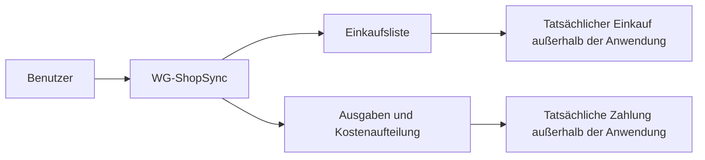
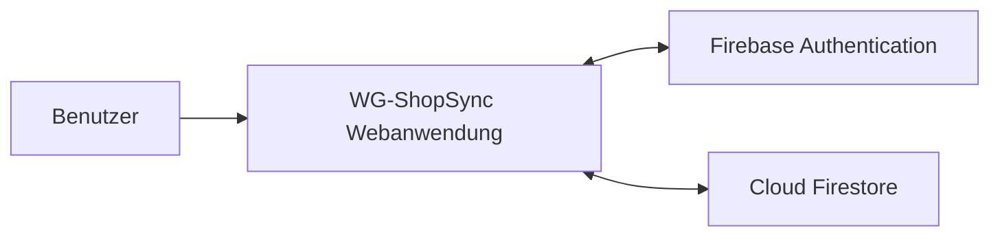
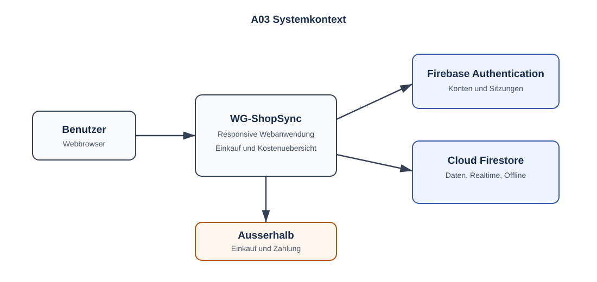

# A03 – Kontextabgrenzung

## 1. Fachlicher Kontext

WG-ShopSync unterstützt die Planung und Dokumentation. Der tatsächliche Einkauf und die Rückzahlung von Geld liegen außerhalb der Systemgrenze.

## 2. Technischer Kontext

### Firebase Authentication

Verwaltet Benutzerkonto, Login, Authentifizierungsstatus und Benutzer-ID.

### Cloud Firestore

Cloud Firestore speichert die in [D1 – Datenmodell](../spec/D1-datenmodell.md) definierten Entitäten sowie die in [D2 – Datentypen](../spec/D2-datentypen.md) beschriebenen fachlichen Datentypen. Dazu gehören Benutzerprofile, WGs, Memberships, Einkaufsartikel, Ausgaben, Kostenanteile und Schulden. Echtzeit-Listener verteilen Änderungen an verbundene Browser.

## 3. Externe Schnittstellen

Die Anwendung kommuniziert ausschließlich mit den Firebase-Diensten Firebase Authentication und Cloud Firestore über HTTPS. Beide Dienste werden über die offiziellen Firebase Web-SDKs angesprochen; eine direkte REST-Kommunikation außerhalb der SDKs ist nicht vorgesehen.

| Schnittstelle | Protokoll / Technologie | Richtung | Beschreibung |
|---|---|---|---|
| Firebase Authentication | HTTPS über Firebase Web SDK | bidirektional | Registrierung, Login, Logout, Sitzungsverwaltung und ID-Token-Erneuerung. |
| Cloud Firestore | Firebase Web SDK mit HTTPS und verwaltetem Realtime-Kanal | bidirektional | Lesen, Schreiben, Realtime-Listener für Echtzeit-Updates und Offline-Persistenz über den SDK-internen Cache. |

Weitere externe Schnittstellen wie Bankdienste, Online-Shops, Preisvergleichsdienste oder Zahlungsanbieter werden in der ersten Version nicht unterstützt.
