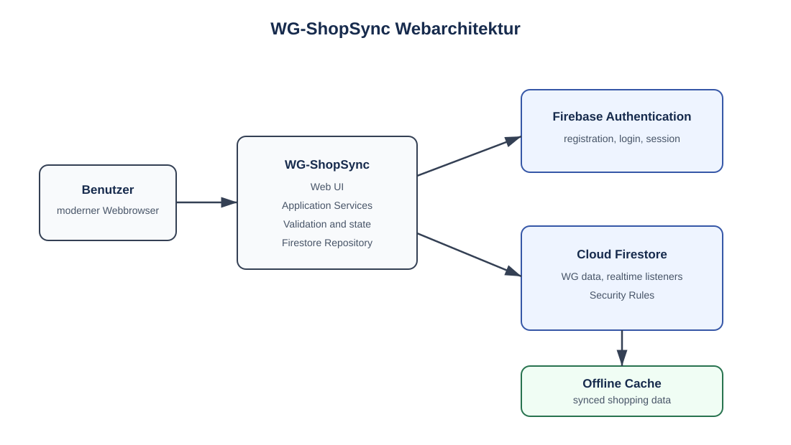

# A04 – Lösungsstrategie

## 1. Grundprinzip

WG-ShopSync wird als responsive Webanwendung umgesetzt. Die Weboberfläche und die gemeinsame Geschäftslogik laufen im Browser; Firebase stellt Authentifizierung, Datenhaltung und Synchronisation bereit.

## 2. Architekturstrategie

Die Anwendung wird in folgende Verantwortungsbereiche gegliedert:

1. **Präsentation:** Screens, Formulare, Navigation und Zustandsdarstellung.
2. **Anwendungslogik:** Validierung, Kostenaufteilung, Saldo- und Statusberechnung.
3. **Datenzugriff:** Firebase Authentication, Firestore-Abfragen, Streams und Schreiboperationen.
4. **Lokale Synchronisation:** Nutzung der Firestore-Offline-Persistenz und Behandlung von Konflikten.

## 3. Fachliche Strategien

- Neue Artikel erhalten den Status `open`; gekaufte Artikel den Status `bought`.
- Schulden verwenden die Statuswerte `open` und `paid`.
- Kosten werden in Cent beziehungsweise mit fester Dezimalpräzision verarbeitet, damit Rundungsfehler kontrolliert werden.
- Die Summe der ExpenseShares muss exakt dem Ausgabebetrag entsprechen; die Verteilung erfolgt gleichmäßig auf alle oder ausgewählte Mitglieder.
- Bereits bezahlte Schulden werden bei der Berechnung offener Salden nicht berücksichtigt.
- Bei konkurrierenden Änderungen gewinnt der Serverstand. Der Konflikt wird angezeigt und die lokale Änderung kann nach Prüfung erneut angewendet werden.

## 4. Sicherheitsstrategie

Die Webanwendung unterstützt im MVP die Anmeldung mit E-Mail-Adresse und Passwort über Firebase Authentication. Weitere Provider wie Google, GitHub oder Apple sind nicht Bestandteil der aktuellen Spezifikation. Firebase verwaltet Sitzungen, ID-Token und deren Erneuerung über das Web-SDK; die Anwendung speichert keine Passwörter selbst.

Jede Firestore-Operation wird serverseitig durch Security Rules auf die authentifizierte Benutzer-ID und die Membership der adressierten WG begrenzt. Rollen werden in `Membership.role` gespeichert. `admin` und `member` besitzen die in N2 und D2 beschriebenen Rechte. Der letzte `admin` darf eine WG nicht verlassen, solange kein anderer `admin` vorhanden ist.

Die Webauslieferung erfolgt über HTTPS. Für die produktive Webumgebung werden zusätzlich eine restriktive Content-Security-Policy, `frame-ancestors` beziehungsweise `X-Frame-Options` und eine Whitelist der benötigten Firebase-Endpunkte vorgesehen. CORS wird nur für tatsächlich getrennte Ursprünge konfiguriert; bei einer gemeinsam ausgelieferten Webanwendung sind keine offenen Wildcard-Ursprünge erlaubt.

### Beispielhafte Firestore Security Rules

Die folgenden Regeln sind ein fachlicher Ausschnitt und müssen bei der Implementierung an die konkrete Collection-Struktur angepasst werden:

```text
function signedIn() {
	return request.auth != null;
}

function isMember(wgId) {
	return signedIn()
		&& exists(/databases/$(database)/documents/wgs/$(wgId)/memberships/$(request.auth.uid));
}

match /wgs/{wgId} {
	allow read: if isMember(wgId);
	allow update: if isMember(wgId);
}

match /wgs/{wgId}/shoppingItems/{itemId} {
	allow read, write: if isMember(wgId);
}
```

Die Regel verhindert den Zugriff auf Daten einer fremden WG. Fachliche Regeln wie die Gleichverteilung von Kostenanteilen, Rundung und Saldenberechnung bleiben in der Anwendungslogik.

## 5. Offline- und Konfliktstrategie

Offline unterstützt werden ausschließlich bereits synchronisierte Einkaufslistendaten und deren lokale Bearbeitung. Registrierung, Login ohne vorhandene Sitzung, WG-Erstellung, WG-Beitritt sowie erstmaliges Laden nicht synchronisierter Daten benötigen eine Verbindung. Ausgaben und Schulden werden im MVP nicht als eigenständiger Offline-Workflow versprochen.

Nach dem Reconnect synchronisiert Firestore lokale Änderungen. Bei konkurrierenden Änderungen gilt der Serverstand. Die Weboberfläche zeigt einen Konflikthinweis mit dem betroffenen Artikel und bietet eine erneute Aktion wie „Lokale Änderung erneut anwenden“ an. Eine lokale Änderung darf nicht als erfolgreich angezeigt werden, wenn sie vom Serverstand verworfen wurde.

## 6. Architekturübersicht

Das folgende Diagramm ergänzt die Detailansichten in A05 und A07. Die SVG-Datei ist als druckbare Abbildung unter `images/architektur-komponenten.svg` versioniert.


