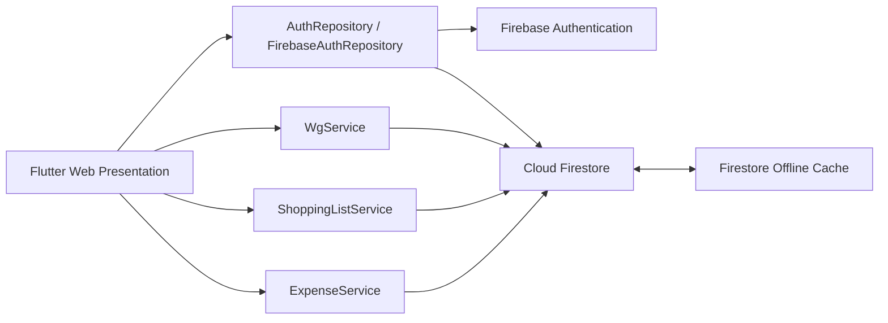

# A04 – Lösungsstrategie

## 1. Grundprinzip

WG-ShopSync wird als responsive Webanwendung umgesetzt. Die Weboberfläche und die gemeinsame Geschäftslogik laufen im Browser; Firebase stellt Authentifizierung, Datenhaltung und Synchronisation bereit.

## 2. Architekturstrategie

Die Anwendung wird in folgende Verantwortungsbereiche gegliedert:

1. **Präsentation:** Screens, Formulare, Navigation und Zustandsdarstellung.
2. **Anwendungslogik:** Validierung, Kostenaufteilung, Saldo- und Statusberechnung.
3. **Datenzugriff:** Firebase Authentication, Firestore-Abfragen, Streams und Schreiboperationen.
4. **Lokale Synchronisation:** Nutzung der Firestore-Offline-Persistenz und Behandlung von Konflikten.

## 3. Fachliche Strategien

- Neue Artikel erhalten den Status `open`; gekaufte Artikel den Status `bought`.
- Schulden verwenden die Statuswerte `open` und `paid`.
- Kosten werden in Cent beziehungsweise mit fester Dezimalpräzision verarbeitet, damit Rundungsfehler kontrolliert werden.
- Die Summe der ExpenseShares muss exakt dem Ausgabebetrag entsprechen; die Verteilung erfolgt gleichmäßig auf alle oder ausgewählte Mitglieder.
- Bereits bezahlte Schulden werden bei der Berechnung offener Salden nicht berücksichtigt.
- Bei konkurrierenden Änderungen gewinnt der Serverstand. Der Konflikt wird angezeigt; der Benutzer kann den aktuellen Serverstand laden und anschließend eine neue Bearbeitung durchführen.

## 4. Sicherheitsstrategie

Die Webanwendung unterstützt im MVP die Anmeldung mit E-Mail-Adresse und Passwort über Firebase Authentication. `FirebaseAuthRepository` kapselt Registrierung, Login, Logout und Auth-State. Die Anwendung speichert keine Passwörter selbst.

Der Zugriff auf WG-Daten wird serverseitig durch die versionierten Firestore Security Rules in [`firestore.rules`](../../firestore.rules) begrenzt. Geschützte WG-Daten können nur von authentifizierten Mitgliedern der jeweiligen WG gelesen oder verändert werden.

Für Schulden gelten zusätzliche Regeln: Das Lesen ist auf Gläubiger und Schuldner der jeweiligen Debt beschränkt. Den Statuswechsel einer offenen eigenen Verbindlichkeit von `open` auf `paid` darf nur der jeweilige Schuldner ausführen.

Die Rollen werden in `Membership.role` gespeichert. Der WG-Ersteller erhält `admin`, beitretende Benutzer erhalten `member`. Beide Rollen dürfen die für WG-Mitglieder vorgesehenen Einkaufs- und Kostenfunktionen verwenden und den Einladungscode der eigenen WG sehen.

Da im MVP keine Rollenübertragung oder Ernennung eines weiteren `admin` implementiert ist, darf der `admin` die WG nicht verlassen.

Die produktive Webanwendung wird über Firebase Hosting per HTTPS ausgeliefert. Zusätzliche benutzerdefinierte HTTP-Sicherheitsheader wie eine eigene Content-Security-Policy oder `X-Frame-Options` sind im aktuellen MVP nicht konfiguriert und werden daher nicht als implementierte Schutzmaßnahme beansprucht.

Die Firestore Security Rules sind Teil des Repositorys und werden mit der Firebase Emulator Suite automatisiert geprüft. Der verifizierte Abgabestand umfasst 27 erfolgreiche Rules-Tests.
## 5. Offline- und Konfliktstrategie

Cloud Firestore stellt Realtime-Listener und Offline-Persistenz bereit. Bereits synchronisierte Einkaufslistendaten bleiben aus dem lokalen Cache lesbar.

Das Hinzufügen eines neuen Artikels verwendet einen nicht-transaktionalen Firestore-Schreibvorgang. Dieser kann bei fehlender Verbindung lokal als ausstehender Schreibvorgang sichtbar werden und nach Wiederherstellung der Verbindung synchronisiert werden.

Das Bearbeiten bestehender Artikel (UC-07) und das Markieren als gekauft (UC-09) verwenden Firestore-Transaktionen zur Konflikterkennung und benötigen deshalb eine aktive Verbindung.

Registrierung, WG-Erstellung, WG-Beitritt sowie Änderungen an Ausgaben und Schulden benötigen ebenfalls eine aktive Serververbindung.

Bei einer konkurrierenden Änderung gilt der Serverstand. Die Oberfläche informiert den Benutzer über den Konflikt und ermöglicht das Laden des aktuellen Serverstands. Eine gewünschte Änderung kann anschließend als neue Bearbeitung durchgeführt werden.
## 6. Architekturübersicht

Die Architekturübersicht wird als versionierte Mermaid-Quelle direkt im Markdown geführt:

Die detaillierte Zerlegung der Bausteine steht in [A05 – Bausteinsicht](A05-bausteinsicht.md). Laufzeitverhalten und Deployment werden in A06 beziehungsweise A07 beschrieben.