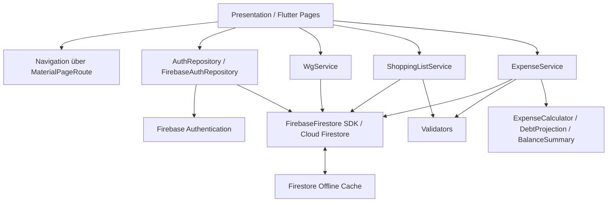

# A05 – Bausteinsicht

## 1. Grobstruktur

## 2. Bausteine

| Baustein | Verantwortung | Zugehörige Use Cases |
|---|---|---|
| Presentation / Flutter Pages | Login, Registrierung, WG-Ansichten, Einkaufsliste sowie Kosten- und Schuldensichten. | UC-01 bis UC-16 |
| Navigation | Übergänge zwischen Authentifizierung, WG-Übersicht, WG-Detail, Einkaufsliste und Kostenübersicht. | UC-01 bis UC-16 |
| `AuthRepository` / `FirebaseAuthRepository` | Registrierung, Login, Logout, Auth-State und Anlage des Benutzerprofils. | UC-01, UC-02 |
| `WgService` | WG erstellen, per Einladungscode beitreten, WG-Kontext und Mitglieder laden sowie WG verlassen. | UC-03, UC-04, UC-05 |
| `ShoppingListService` | Realtime-Liste, Hinzufügen, Bearbeiten, Löschen und Statusänderung von ShoppingItems. | UC-06 bis UC-10 |
| `ExpenseService` | Ausgaben, ExpenseShares, Debts, Zahlungsstatus und Realtime-Finanzdaten. | UC-11 bis UC-16 |
| `Validators` | Prüfung fachlicher Eingaben vor Service-Aufrufen. | UC-01, UC-02, UC-03, UC-04, UC-06, UC-07, UC-11, UC-12 |
| `ExpenseCalculator`, `DebtProjection`, `BalanceSummary` | Cent-genaue Kostenaufteilung, Ableitung von Debt-Dokumenten und Laufzeitberechnung von Salden. | UC-11 bis UC-16 |
| FirebaseFirestore SDK | Direkter Datenzugriff der fachlichen Services auf Cloud Firestore, inklusive Streams und Transaktionen. | UC-03 bis UC-16 |
| Offline- und Fehlerbehandlung | Cache-/Pending-Write-Anzeige, Netzwerkhinweise, Konflikt- und Domain-Exceptions. | insbesondere UC-06 bis UC-10 und UC-12 |
## 3. Daten- und Verantwortungsgrenzen

Die fachlichen Bausteine arbeiten auf den Entitäten aus [D1 – Datenmodell](../spec/D1-datenmodell.md): `User`, `WG`, `Membership`, `ShoppingItem`, `Expense`, `ExpenseShare` und `Debt`. Die Beziehungen und Kardinalitäten werden nicht in der UI dupliziert, sondern durch die Services und Repositories gekapselt.

| Baustein | Zentrale Daten und Regeln |
|---|---|
| WgService | `WG` und `Membership`; Einladungscode, Rollen und die Regel, dass die Erstellerrolle `admin` im MVP nicht verlassen werden kann. |
| ShoppingListService | `ShoppingItem`; CRUD, Kategorien, Mengen und Status `open`/`bought`. |
| ExpenseService | `Expense`, `ExpenseShare` und die aus einer Ausgabe abgeleiteten `Debt`-Dokumente; Zahler, gleichmäßige Kostenaufteilung auf Beteiligte und expense-bezogene Schuldenerzeugung. |
| Debt/Saldo-Logik | Laufzeitberechnung des Saldos aus den offenen `Debt`-Dokumenten mehrerer Ausgaben; bezahlte Schulden bleiben als Historie erhalten. |
| FirebaseFirestore SDK | Persistenz, Abfragen, Streams und Transaktionen; die fachlichen Services greifen direkt über das Firebase SDK auf Firestore zu. |

Ein `Expense` gehört genau einer WG und besitzt einen oder mehrere `ExpenseShare`-Einträge. `paidBy`, `creditorId` und `debtorId` müssen Mitglieder derselben WG referenzieren. Die konkreten Attribute und Kardinalitäten sind in D1 und D2 normativ beschrieben.

## 4. Abhängigkeiten

Die Flutter-Presentation verwendet die jeweiligen Application Services beziehungsweise das Auth-Repository.

`FirebaseAuthRepository` greift direkt auf Firebase Authentication und für das Benutzerprofil auf Cloud Firestore zu.

`WgService`, `ShoppingListService` und `ExpenseService` greifen direkt über `FirebaseFirestore` auf Cloud Firestore zu. Ein zusätzliches zentrales Firestore-Repository wird im finalen Implementierungsstand nicht verwendet.

Fachliche Berechnungen werden davon getrennt in `Validators`, `ExpenseCalculator`, `DebtProjection` und `BalanceSummary` ausgeführt und können unabhängig vom produktiven Firebase-Zugriff getestet werden.

Die Firestore-Offline-Persistenz ist Teil des Firebase SDK. Realtime-Streams liefern zusätzlich Metadaten zu Cache-Zustand und ausstehenden Schreibvorgängen an die Einkaufsliste.