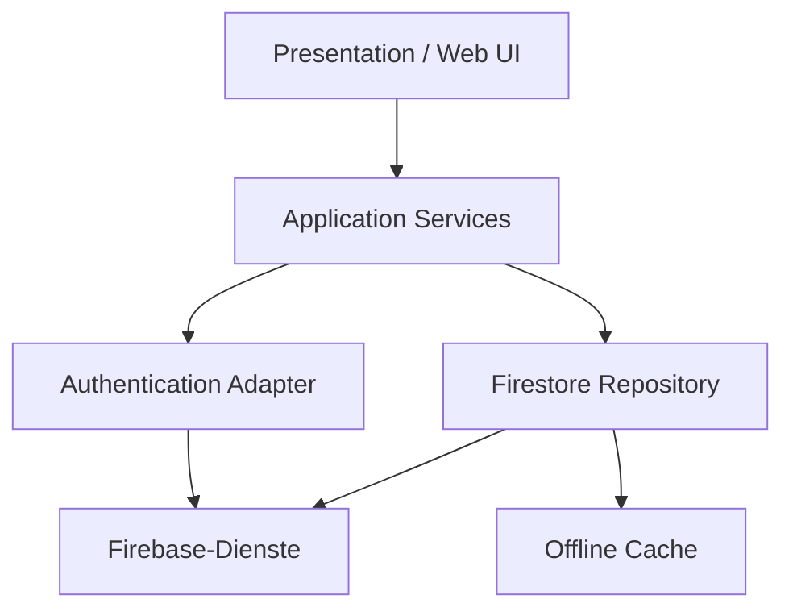

# A05 – Bausteinsicht

## 1. Grobstruktur

## 2. Bausteine

| Baustein | Verantwortung | Zugehörige Use Cases |
|---|---|---|
| Presentation | Weboberfläche für Login, WG, Einkaufsliste, Ausgaben und Profil. | UC-01 bis UC-16 |
| Navigation | Übergänge zwischen nicht authentifiziertem Bereich, WG-Übersicht, Einkaufsliste, Kostenübersicht und Profil. | UC-01 bis UC-16 |
| AuthService | Registrierung, Login, Logout und Beobachtung der Sitzung. | UC-01, UC-02 |
| WGService | Erstellen, Beitreten, Anzeigen und Verlassen einer WG. | UC-03, UC-04, UC-05 |
| ShoppingListService | CRUD-Operationen und Statusänderungen für ShoppingItems. | UC-06 bis UC-10 |
| ExpenseService | Ausgaben, ExpenseShares, Schulden und Salden. | UC-11 bis UC-16 |
| Validation | Prüfung von Eingaben und fachlichen Regeln vor dem Speichern. | UC-01, UC-03, UC-04, UC-06, UC-11, UC-13 |
| FirestoreRepository | Lesen, Schreiben, Streams und Transaktionen gegen Firestore. | UC-03 bis UC-16 |
| Offline & Error Handling | Offline-Status, Konflikthinweise und verständliche Fehler. | UC-02, UC-06 bis UC-16 |

## 3. Daten- und Verantwortungsgrenzen

Die fachlichen Bausteine arbeiten auf den Entitäten aus [D1 – Datenmodell](../spec/D1-datenmodell.md): `User`, `WG`, `Membership`, `ShoppingItem`, `Expense`, `ExpenseShare` und `Debt`. Die Beziehungen und Kardinalitäten werden nicht in der UI dupliziert, sondern durch die Services und Repositories gekapselt.

| Baustein | Zentrale Daten und Regeln |
|---|---|
| WGService | `WG` und `Membership`; Einladungscode, Rollen und die Regel für den letzten `admin`. |
| ShoppingListService | `ShoppingItem`; CRUD, Kategorien, Mengen und Status `open`/`bought`. |
| ExpenseService | `Expense` und `ExpenseShare`; Zahler und gleichmäßige Kostenaufteilung auf Beteiligte. |
| Debt/Saldo-Logik | `Debt`; offene und bezahlte Schulden sowie eigene Forderungen und Verbindlichkeiten. |
| FirestoreRepository | Persistenz, Abfragen, Streams und Transaktionen; keine fachliche UI-Logik. |

Ein `Expense` gehört genau einer WG und besitzt einen oder mehrere `ExpenseShare`-Einträge. `paidBy`, `creditorId` und `debtorId` müssen Mitglieder derselben WG referenzieren. Die konkreten Attribute und Kardinalitäten sind in D1 und D2 normativ beschrieben.

## 4. Abhängigkeiten

Die UI verwendet Application Services. Application Services verwenden Validierung und Repositories. Nur Repositories und AuthService greifen direkt auf Firebase zu. Dadurch bleibt die fachliche Logik von konkreten Screens isoliert.
