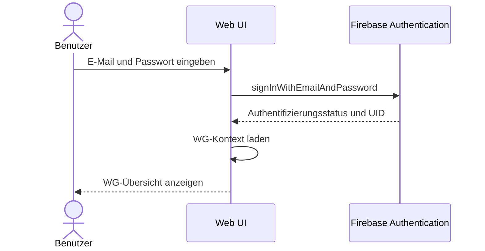
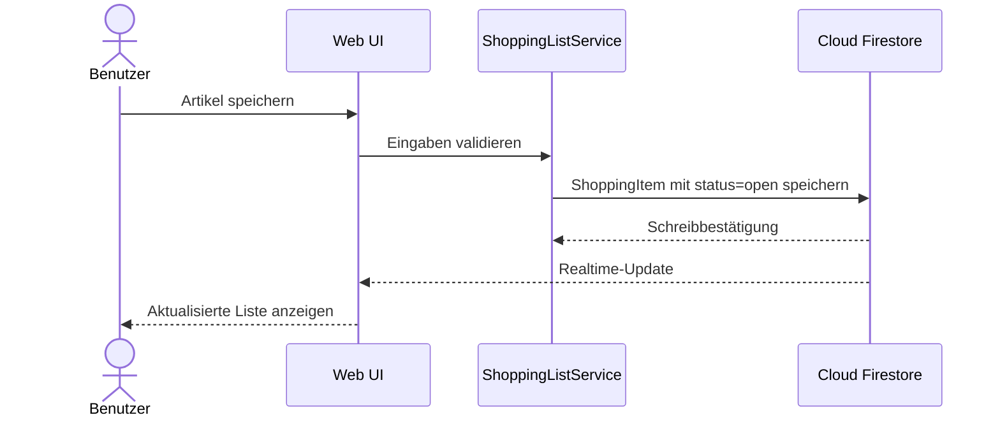
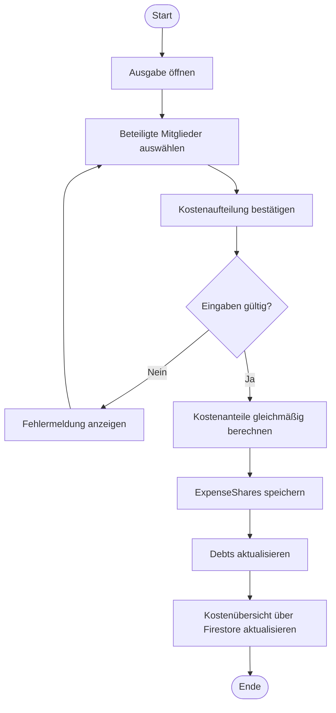

# A06 – Laufzeitsicht

## 1. Login

## 2. Artikel hinzufügen

## 3. Kosten aufteilen

### Aktivitätsdiagramm – Kosten aufteilen

Der `ExpenseService` prüft vor der Berechnung die WG-Zugehörigkeit, den Betrag und mindestens ein beteiligtes Mitglied. Cent-Rundungen werden ausgeglichen, sodass die Summe der `ExpenseShares` exakt dem Ausgabebetrag entspricht.

## 4. Offline-Änderung

Firestore stellt den letzten lokalen Stand bereit. Eine Änderung an einer zuvor synchronisierten Einkaufsliste wird lokal vorgemerkt und nach Wiederherstellung der Verbindung an Firestore übertragen. Bei einem Konflikt bleibt der Serverstand gültig und die lokale Änderung wird als Konflikthinweis angezeigt.

## 5. WG erstellen und beitreten

### Aktivitätsdiagramm – WG erstellen oder beitreten

Beim Verlassen einer WG prüft der `WGService`, ob das Mitglied der letzte `admin` ist. In diesem Fall wird das Verlassen abgelehnt; andernfalls wird die Membership entfernt.

## 6. Ausgabe bearbeiten und Kostenübersicht

1. Das Mitglied öffnet eine bestehende Ausgabe; der `ExpenseService` prüft WG-Zugehörigkeit, Betrag und Beteiligte.
2. Die bestehenden `ExpenseShare`- und `Debt`-Einträge werden anhand der neuen Daten aktualisiert.
3. Der Saldo berücksichtigt offene Schulden und ignoriert Schulden mit Status `paid`.
4. Die Kostenübersicht zeigt dem angemeldeten Mitglied nur die eigenen Kostenanteile, Forderungen und Verbindlichkeiten.

## 7. Schuld bezahlen und WG verlassen

1. Das Mitglied markiert eine eigene offene Schuld als bezahlt.
2. Der Service setzt den Status auf `paid`, speichert das Zahlungsdatum und lässt den ursprünglichen Betrag unverändert.
3. Beim Verlassen prüft der `WGService`, ob das Mitglied der letzte `admin` ist. In diesem Fall wird das Verlassen abgelehnt; andernfalls wird die Membership entfernt.
