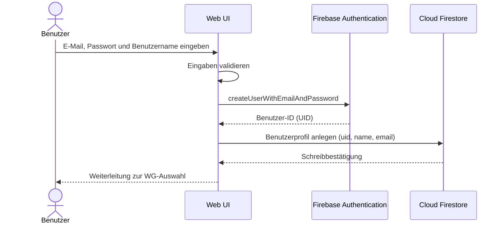
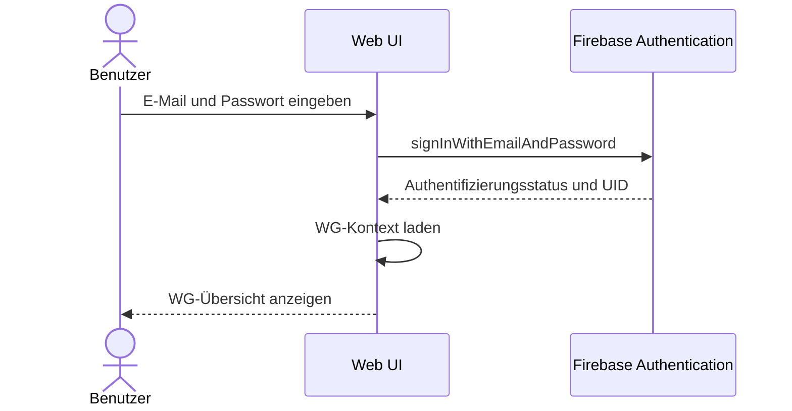
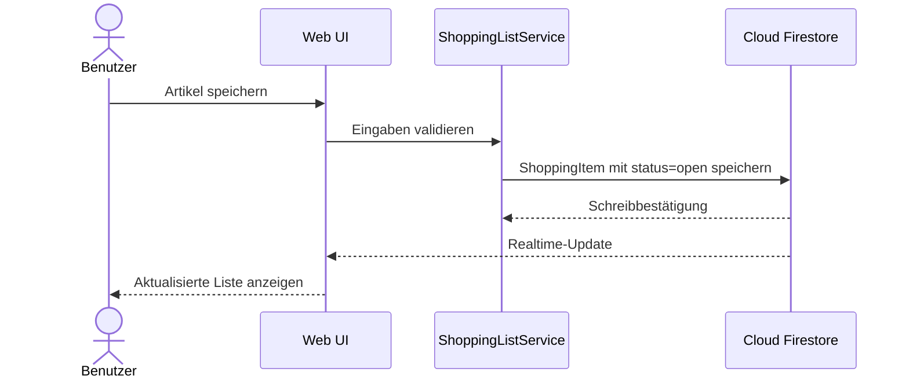
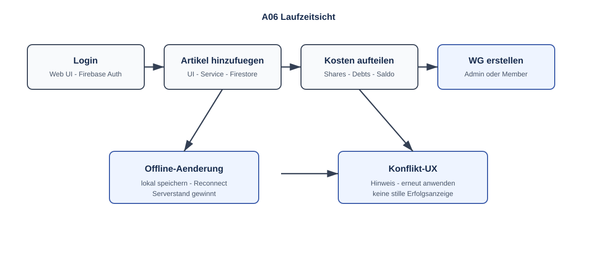
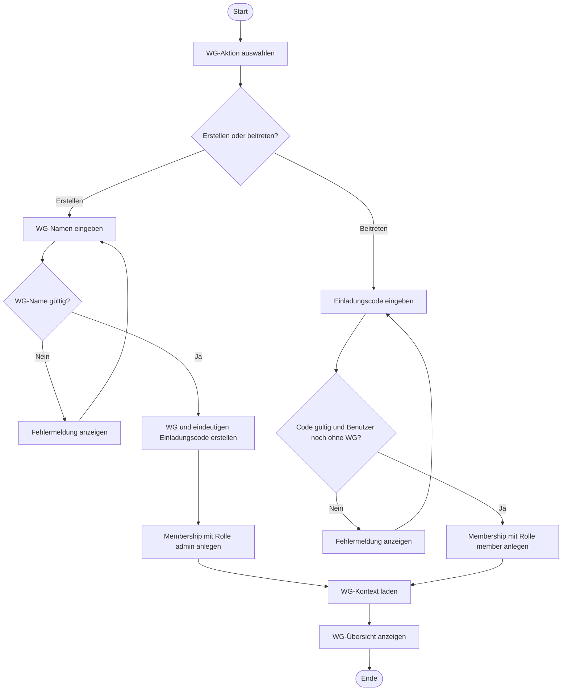

# A06 – Laufzeitsicht

## 1. Registrierung

Der `FirebaseAuthRepository` legt nach erfolgreicher Registrierung bei Firebase Authentication ein Benutzerprofil in Firestore an. Ist die E-Mail bereits vergeben oder das Passwort ungültig, gibt Firebase Authentication einen Fehler zurück, der dem Benutzer als verständliche Fehlermeldung angezeigt wird. Ohne Verbindung ist die Registrierung nicht möglich.

## 2. Login

## 3. Artikel hinzufügen

## 4. Kosten aufteilen

### Aktivitätsdiagramm – Kosten aufteilen

Der `ExpenseService` prüft vor der Berechnung die WG-Zugehörigkeit, den Betrag und mindestens ein beteiligtes Mitglied. Cent-Rundungen werden ausgeglichen, sodass die Summe der `ExpenseShares` exakt dem Ausgabebetrag entspricht.
Für jedes beteiligte Mitglied außer dem Zahler erzeugt der `ExpenseService` eine eigene, der Ausgabe zugeordnete `Debt` in Höhe des jeweiligen Kostenanteils. Bei einer Änderung der Ausgabe werden ausschließlich die dieser Ausgabe zugeordneten, noch offenen `Debt`-Dokumente angepasst; bereits bezahlte Schulden bleiben unverändert erhalten. Alle Lesezugriffe innerhalb der Firestore-Transaktion (Mitgliedschaften, bestehende Kostenanteile, betroffene Schulden) erfolgen vor jedem Schreibzugriff.

## 5. Offline-Verhalten

Bereits synchronisierte Einkaufslistendaten können über den Firestore-Cache weiterhin angezeigt werden.

Beim Hinzufügen eines neuen Artikels wartet `ShoppingListService.addItem()` auf Flutter Web nicht synchron auf den Serverabschluss. Der Firestore-Schreibvorgang kann lokal als `hasPendingWrites` sichtbar werden und wird nach Wiederherstellung der Verbindung synchronisiert.

`ShoppingListService.updateItem()` und `markAsBought()` verwenden zur Konfliktprüfung Firestore-Transaktionen. Diese Aktionen benötigen eine aktive Verbindung und liefern bei Offline-Zustand eine verständliche Fehlermeldung, statt eine ungesicherte lokale Änderung auszuführen.

Bei einem online erkannten Konkurrenzkonflikt bleibt der Serverstand maßgeblich. Der Benutzer kann die Serverdaten laden und anschließend erneut bearbeiten.
## 6. WG erstellen und beitreten

### Aktivitätsdiagramm – WG erstellen oder beitreten

Beim Verlassen einer WG erlaubt der `WgService` das Entfernen nur für die Rolle `member`. Die Erstellerrolle `admin` kann im MVP nicht verlassen werden, weil keine Rollenübertragung oder Ernennung eines weiteren `admin` vorgesehen ist.

## 7. Ausgabe bearbeiten und Kostenübersicht

1. Das Mitglied öffnet eine bestehende Ausgabe; der `ExpenseService` prüft WG-Zugehörigkeit, Betrag und Beteiligte.
2. Die bestehenden `ExpenseShare`- und `Debt`-Einträge werden anhand der neuen Daten aktualisiert.
3. Der Saldo berücksichtigt offene Schulden und ignoriert Schulden mit Status `paid`.
4. Die Kostenübersicht zeigt dem angemeldeten Mitglied nur die eigenen Kostenanteile, Forderungen und Verbindlichkeiten.

## 8. Schuld bezahlen und WG verlassen

1. Das Mitglied markiert eine eigene offene Schuld als bezahlt.
2. Der Service setzt den Status auf `paid`, speichert das Zahlungsdatum und lässt den ursprünglichen Betrag unverändert.
3. Beim Verlassen erlaubt der `WgService` das Entfernen nur für die Rolle `member`. Die Erstellerrolle `admin` kann im MVP nicht verlassen werden, da keine Rollenübertragung oder Ernennung eines weiteren `admin` vorgesehen ist.
