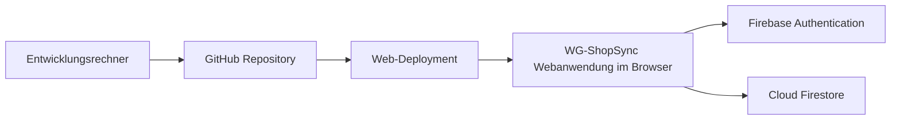
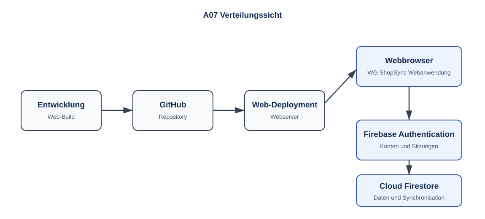

# A07 – Verteilungssicht

## 1. Entwicklungs- und Laufzeitumgebung

## 2. Knoten

| Knoten | Inhalt |
|---|---|
| Browser auf Desktop oder mobilem Endgerät | Webanwendung und browserabhängiger lokaler Cache |
| GitHub Repository | Versionierter Quellcode und Web-Build-Artefakte |
| Web-Deployment | Veröffentlichung der Webanwendung auf dem Webserver |
| Firebase Authentication | Verwaltet Konten und Sitzungen |
| Cloud Firestore | Zentrale Datenhaltung, Streams und Security Rules |

## 3. Betrieb

Es wird kein eigener App-Server betrieben. Firebase-Dienste werden als verwaltete Cloud-Dienste genutzt. Konfigurationsdaten und Firebase-Zugänge werden nicht fest in den Quellcode eingebettet.

## 4. Inbetriebnahme und Konfiguration

Für jede Umgebung wird ein Firebase-Projekt mit aktivierter Firebase Authentication und einer konfigurierten Cloud-Firestore-Datenbank benötigt. Die Web-Konfiguration und Umgebungswerte werden getrennt von vertraulichen Zugangsdaten verwaltet.

Die Firestore Security Rules werden gemeinsam mit der Anwendung versioniert, vor dem Rollout geprüft und so veröffentlicht, dass nur authentifizierte Mitglieder der jeweiligen WG auf deren Daten zugreifen können. Die Inbetriebnahme umfasst anschließend den Web-Build sowie einen Test der Registrierung, WG-Verwaltung, Synchronisation, Offline-Funktion und Autorisierung.

Details zu Voraussetzungen, Deployment und Rollout stehen in [S3 – Inbetriebnahme](../spec/S3-inbetriebnahme.md).

Die in dieser Verteilungssicht dargestellten Deployment-Einheiten entsprechen den in [A05 – Bausteinsicht](A05-bausteinsicht.md) beschriebenen Bausteinen und ihrer technischen Umsetzung. Die Webanwendung enthält insbesondere die Presentation, Navigation und Application Services; Firebase übernimmt Authentifizierung, Persistenz und Synchronisation.
