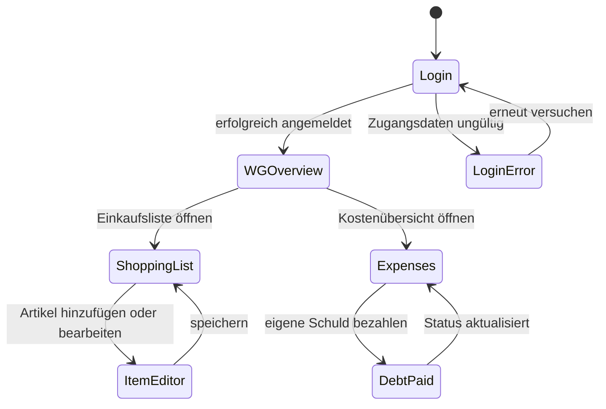
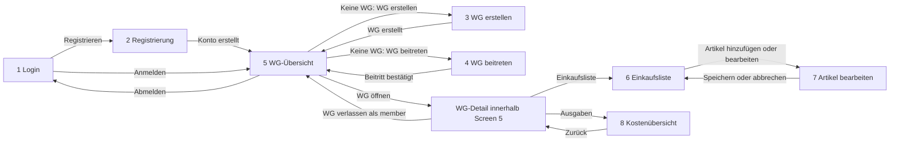

# B1 – Dialogspezifikation

## Zielsetzung
Die Dialogspezifikation beschreibt die Benutzeroberfläche von WG-ShopSync sowie die Navigation zwischen den einzelnen Screens. Sie konkretisiert die in F2 beschriebenen Anwendungsfälle und dient als Grundlage für die Entwicklung der Benutzeroberfläche, die Implementierung der Navigation sowie die Durchführung von System- und Abnahmetests.

Jeder Screen realisiert einen oder mehrere Anwendungsfälle aus F2 und greift auf die im Datenmodell D1 definierten Entitäten sowie die in D2 beschriebenen Datentypen und Validierungsregeln zu.

## B1.0 Statische und dynamische GUI

Die statische GUI beschreibt die dauerhaft sichtbare Struktur der Screens: Navigation, Eingabefelder, Listenbereiche, Aktionen und Zustände. Die dynamische GUI beschreibt Reaktionen auf Benutzeraktionen und Systemereignisse, beispielsweise Validierungsfehler, Ladezustände, leere Listen, Offline-Modus, Synchronisationskonflikte und Statuswechsel.

Die Screens verwenden die Entitäten aus [D1 – Datenmodell](D1-datenmodell.md). Feldtypen, Kardinalitäten und fachliche Validierungsregeln werden aus [D2 – Datentypen](D2-datentypen.md) übernommen und nicht separat in der GUI neu definiert.

### Mockups und Zustände

Die vorhandenen Mockups befinden sich unter [`images/mockups/`](images/mockups/README.md) und zeigen die zentralen Zustände für Login, Registrierung, WG-Übersicht, Artikelerfassung und Kostenübersicht. Für die übrigen Screens wird die Darstellung aus den beschriebenen statischen Elementen und den dynamischen Zuständen abgeleitet.

Jeder relevante Screen berücksichtigt mindestens den Normalzustand, einen Ladezustand, einen Leerzustand, einen Validierungsfehler und den Offline- beziehungsweise Synchronisationszustand, sofern dieser für den Screen relevant ist. Diese Zustände sind Teil der GUI-Spezifikation und keine zusätzlichen Anwendungsfälle.

---

# B1.1 Übersicht

| Screen | Zweck | Kernelemente | Navigation | Bezug zu UCs |
|----------|----------|----------|----------|----------|
| 1 – Login | Anmeldung | E-Mail, Passwort, Login-Button | → 5, → 2 | UC-02 |
| 2 – Registrierung | Kontoerstellung | Name, E-Mail, Passwort, Passwort-Wiederholung | → 5, → 1 | UC-01 |
| 3 – WG erstellen | Neue WG anlegen | WG-Name, Erstellen-Button | → 5 | UC-03 |
| 4 – WG beitreten | WG über Invite-Code beitreten | Invite-Code, Beitreten-Button | → 5 | UC-04 |
| 5 – WG-Übersicht / WG-Ansicht | Zentrale Start- und WG-Ansicht | WG-Status, Rolle, WG öffnen, Invite-Code im WG-Detail, Abmelden, WG verlassen | → 6, → 8, → 3, → 4, → 1 | UC-03, UC-04, UC-05 |
| 6 – Einkaufsliste | Gemeinsame Einkaufsliste | Artikelliste, Checkboxen, FAB | → 7 | UC-06 bis UC-10 |
| 7 – Artikel hinzufügen/bearbeiten | Artikel erfassen oder ändern | Name, Menge, Kategorie | → 6 | UC-06, UC-07 |
| 8 – Kostenübersicht | Ausgaben, Kostenanteile, Salden und Schulden | Ausgabenliste, Kostenanteile, Forderungen, Verbindlichkeiten und Zahlungsstatus | → 5 | UC-11 bis UC-16 |

---

# B1.2 Screen 1 – Login

## Zweck

Anmeldung eines bereits registrierten Nutzers.

## Bezug zu UC

[UC-02 – Einloggen](F2-anwendungsfaelle.md#uc-02--einloggen)

## Vorbedingungen

- Ein Benutzerkonto existiert.

## Felder

| Feld | Typ | Pflicht | Validierung |
|----------|----------|----------|----------|
| E-Mail | String | Ja | gültiges E-Mail-Format |
| Passwort | String | Ja | nicht leer |

## Kernelemente

- Eingabefeld E-Mail
- Eingabefeld Passwort
- Button „Einloggen“
- Link „Noch kein Konto? Registrieren“

## Fehlerfälle

- Ungültige Zugangsdaten → Meldung „E-Mail oder Passwort falsch“
- Keine Verbindung, aber gültige lokale Sitzung vorhanden → automatischer Offline-Start

## Mockup

  

## Navigation

- Erfolgreiche Anmeldung → Screen 5
- Link Registrierung → Screen 2

---

# B1.3 Screen 2 – Registrierung

## Zweck

Anlage eines neuen Benutzerkontos.

## Bezug zu UC

[UC-01 – Registrieren](F2-anwendungsfaelle.md#uc-01--registrieren)

## Vorbedingungen

- Die verwendete E-Mail-Adresse ist noch nicht registriert.

## Felder

| Feld | Typ | Pflicht | Validierung |
|----------|----------|----------|----------|
| Name | String (2–50) | Ja | 2–50 Zeichen |
| E-Mail | String | Ja | gültiges Format |
| Passwort | String | Ja | mindestens 8 Zeichen |
| Passwort-Bestätigung | String | Ja | muss übereinstimmen |

## Fehlerfälle

- E-Mail bereits vergeben
- Ungültige Eingaben
- Keine Internetverbindung

## Mockup

  

## Navigation

- Erfolgreiche Registrierung → Screen 5
- Zurück → Screen 1
- 
---

# B1.4 Screen 3 – WG erstellen

## Zweck

Erstellung einer neuen Wohngemeinschaft.

## Bezug zu UC

[UC-03 – WG erstellen](F2-anwendungsfaelle.md#uc-03--wg-erstellen)

## Vorbedingungen

- Nutzer ist angemeldet.

## Felder

| Feld | Typ | Pflicht | Validierung |
|----------|----------|----------|----------|
| WG-Name | String (2–50) | Ja | nicht leer |

## Fehlerfälle

- WG-Name leer
- Technischer Fehler bei Erstellung

## Navigation

- Erfolgreich → Screen 5

---

# B1.5 Screen 4 – WG beitreten

## Zweck

Beitritt zu einer bestehenden Wohngemeinschaft.

## Bezug zu UC

[UC-04 – WG beitreten](F2-anwendungsfaelle.md#uc-04--wg-beitreten)

## Vorbedingungen

- Nutzer ist angemeldet.
- Invite-Code liegt vor.

## Felder

| Feld | Typ | Pflicht | Validierung |
|----------|----------|----------|----------|
| Invite-Code | String (6) | Ja | Format gemäß D2 |

## Fehlerfälle

- Ungültiger Invite-Code
- Nutzer ist bereits WG-Mitglied

## Navigation

- Erfolgreich → Screen 5

---

# B1.6 Screen 5 – WG-Übersicht / WG-Ansicht

## Zweck

Zentrale Startseite nach der Anmeldung und Einstieg in die Funktionen der eigenen WG.

## Bezug zu UC

- [UC-03 – WG erstellen](F2-anwendungsfaelle.md#uc-03--wg-erstellen)
- [UC-04 – WG beitreten](F2-anwendungsfaelle.md#uc-04--wg-beitreten)
- [UC-05 – WG verlassen](F2-anwendungsfaelle.md#uc-05--wg-verlassen)

## Vorbedingungen

- Nutzer ist angemeldet.

## Kernelemente

### Zustand ohne WG

- Begrüßung und Hinweis, dass noch keine WG zugeordnet ist
- Button „WG erstellen“
- Button „WG beitreten“
- Aktion „Abmelden“ in der App-Bar

### Zustand mit WG

- Name der eigenen WG
- Anzeige der eigenen Rolle `admin` oder `member`
- Button „WG öffnen“
- Aktion „Abmelden“ in der App-Bar

### WG-Detail nach „WG öffnen“

- Name der WG
- Einladungscode der WG
- Anzeige der eigenen Rolle
- Button „Einkaufsliste öffnen“
- Button „Ausgaben öffnen“
- Button „WG verlassen“ mit Bestätigungsdialog

## Fehlerfälle

- Keine WG vorhanden → Zustand mit direkten Aktionen „WG erstellen“ und „WG beitreten“
- WG verlassen als `admin` → verständlicher Hinweis; Mitgliedschaft bleibt bestehen
- Technischer Fehler beim Verlassen → verständliche Fehlermeldung

## Navigation

- Ohne WG → Screen 3 oder Screen 4
- Mit WG → WG-Detail
- WG-Detail → Screen 6 oder Screen 8
- Erfolgreiches Verlassen als `member` → Screen 5 im Zustand ohne WG
- Abmelden → Screen 1

---
# B1.7 Screen 6 – Einkaufsliste

## Zweck

Verwaltung gemeinsamer Einkaufsartikel innerhalb einer WG.

## Bezug zu UC

- [UC-06 – Artikel hinzufügen](F2-anwendungsfaelle.md#uc-06--artikel-hinzufugen)
- [UC-07 – Artikel bearbeiten](F2-anwendungsfaelle.md#uc-07--artikel-bearbeiten)
- [UC-08 – Artikel löschen](F2-anwendungsfaelle.md#uc-08--artikel-loschen)
- [UC-09 – Artikel als gekauft markieren](F2-anwendungsfaelle.md#uc-09--artikel-als-gekauft-markieren)
- [UC-10 – Einkaufsliste anzeigen](F2-anwendungsfaelle.md#uc-10--einkaufsliste-anzeigen)
- 
## Vorbedingungen

- Nutzer ist Mitglied der WG.

## Kernelemente

- Artikelliste
- Gruppierung nach Status
- Gruppierung nach Kategorie
- Checkbox zum Markieren als gekauft
- Swipe-Gesten zum Löschen
- Floating Action Button „+“

## Fehlerfälle

- Keine Artikel vorhanden
- Offline angelegte Artikel warten auf Synchronisation
- Synchronisierungskonflikte

## Navigation

- Neuer Artikel → Screen 7
- Artikel bearbeiten → Screen 7
- Zurück → Screen 5

---

# B1.8 Screen 7 – Artikel hinzufügen / bearbeiten

## Zweck

Anlegen oder Bearbeiten von Einkaufsartikeln.

## Bezug zu UC

- [UC-06 – Artikel hinzufügen](F2-anwendungsfaelle.md#uc-06--artikel-hinzufugen)
- [UC-07 – Artikel bearbeiten](F2-anwendungsfaelle.md#uc-07--artikel-bearbeiten)

## Vorbedingungen

- Nutzer ist Mitglied der WG.

## Felder

| Feld | Typ | Pflicht | Validierung |
|----------|----------|----------|----------|
| Name | String (1–100) | Ja | 1–100 Zeichen |
| Beschreibung | String (0–500) | Nein | höchstens 500 Zeichen |
| Menge | positive Ganzzahl | Nein | bei Angabe mindestens 1 |
| Kategorie | Enum | Nein | Kategorie aus D2 |

## Fehlerfälle

- Artikelname leer
- Synchronisierungskonflikte

## Mockup

  

## Navigation

- Speichern → Screen 6
- Abbrechen → Screen 6

---

# B1.9 Screen 8 – Kostenübersicht

## Zweck

Verwaltung gemeinsamer Ausgaben und Anzeige offener Salden.

## Bezug zu UC

- [UC-11 – Ausgabe erfassen](F2-anwendungsfaelle.md#uc-11--ausgabe-erfassen)
- [UC-12 – Ausgabe bearbeiten](F2-anwendungsfaelle.md#uc-12--ausgabe-bearbeiten)
- [UC-13 – Kosten aufteilen](F2-anwendungsfaelle.md#uc-13--kosten-aufteilen)
- [UC-14 – Schulden anzeigen](F2-anwendungsfaelle.md#uc-14--schulden-anzeigen)
- [UC-15 – Schuld als bezahlt markieren](F2-anwendungsfaelle.md#uc-15--schuld-als-bezahlt-markieren)
- [UC-16 – Kostenübersicht anzeigen](F2-anwendungsfaelle.md#uc-16--kostenubersicht-anzeigen)

## Vorbedingungen

- Nutzer ist Mitglied einer WG.

## Felder

| Feld | Typ | Pflicht | Validierung |
|----------|----------|----------|----------|
| Betrag | Decimal(10,2) | Ja | > 0 |
| Beschreibung | String | Ja | nicht leer |
| Zahlender | Auswahl Mitglied | Ja | gültiges Mitglied |
| Beteiligte Mitglieder | Mehrfachauswahl | Ja | mindestens ein Mitglied |

## Kernelemente

- Ausgabenliste
- Saldenanzeige
- Button „Ausgabe hinzufügen“

## Fehlerfälle

- Betrag kleiner oder gleich 0
- Keine Ausgaben vorhanden

## Mockup

  

## Navigation

- Zurück → Screen 5

---

# B1.10 Gemeinsame Dialogmuster

## Formularvalidierung

Eingaben werden clientseitig und serverseitig validiert. Fehler werden direkt am betroffenen Feld angezeigt.

## Bestätigungsdialoge

Kritische Aktionen benötigen eine ausdrückliche Bestätigung.

Beispiele:

- WG verlassen
- Artikel löschen

## Leerzustände

Falls keine Daten vorhanden sind, werden erklärende Hinweise angezeigt.

Beispiele:

- Keine WG vorhanden
- Keine Artikel vorhanden
- Keine Ausgaben vorhanden

## Offline-Modus

Die zuletzt synchronisierte Einkaufsliste bleibt aus dem Firestore-Cache lesbar. Offline hinzugefügte Artikel können als ausstehende Schreibvorgänge angezeigt und nach Wiederherstellung der Verbindung synchronisiert werden. Bearbeiten und Als-gekauft-Markieren benötigen eine aktive Verbindung.

## Fehlermeldungen

Fehlermeldungen werden verständlich dargestellt und enthalten Hinweise zur Problemlösung.

Beispiele:

- E-Mail oder Passwort falsch
- Ungültiger Invite-Code
- Keine Internetverbindung
- Synchronisationsfehler

---

# B1.11 Navigationsdiagramm

*Abbildung B1-1: Navigationsdiagramm der Benutzerschnittstelle von WG-ShopSync*

Screen 5 bildet den zentralen Einstieg nach der Anmeldung. Ohne WG werden die Aktionen „WG erstellen“ und „WG beitreten“ angeboten. Mit bestehender WG führt „WG öffnen“ in die WG-Detailansicht desselben Funktionsbereichs.

Von der WG-Detailansicht aus werden die Einkaufsliste und die Kostenübersicht geöffnet. Das Verlassen der WG erfolgt ebenfalls dort. Die Abmeldung erfolgt direkt aus der WG-Übersicht über die App-Bar.

Screen 6 zeigt die gemeinsame Einkaufsliste; Screen 7 dient zum Hinzufügen und Bearbeiten von Artikeln. Screen 8 enthält Ausgaben, Kostenanteile, Forderungen, Verbindlichkeiten, Salden und den Zahlungsstatus der eigenen Schulden.

Das Diagramm beschreibt ausschließlich die Navigation auf Ebene der Benutzerschnittstelle. Die fachlichen Abläufe werden separat in F1 und F2 beschrieben.

---
# B1.12 Querverweise

| Block | Relevanz |
|----------|----------|
| F2 | Realisierte Anwendungsfälle |
| D1 | Verwendete Entitäten |
| D2 | Datentypen und Validierungsregeln |
| N1 | Qualitätsanforderungen |
| N2 | Authentifizierung, Synchronisation und Offline-Modus |

Die Dialogspezifikation bildet die Grundlage für die Implementierung der Benutzeroberfläche sowie für die Durchführung von System- und Abnahmetests.
