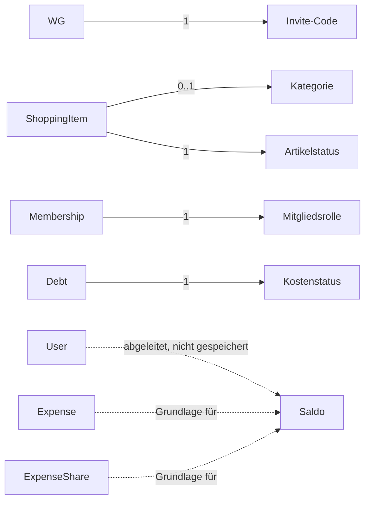

# D2 – Datentypen

Dieses Kapitel beschreibt die Attribute der in D1 definierten Entitäten sowie die fachlichen Datentypen von WG-ShopSync.

Triviale, allgemeine Datentypen wie Text, Integer, Boolean, Email, Timestamp, URL, Identifier und Decimal werden direkt verwendet und hier **nicht** weiter erläutert, da sie keine fachliche Bedeutung tragen. Im Fokus dieses Kapitels stehen ausschließlich die **fachlichen Datentypen**, die spezifisch für WG-ShopSync sind.

---

# D2.1 User

| Attribut | Typ | Kard. | Beschreibung |
|-----------|------|--------|--------------|
| id | Identifier | 1 | Eindeutige technische ID des Benutzers |
| name | Text | 1 | Anzeigename des Benutzers |
| email | Email | 1 | Eindeutige E-Mail-Adresse |
| passwordHash | OpaqueSecret | 1 | Gehashtes Passwort |
| createdAt | Timestamp | 1 | Zeitpunkt der Registrierung |

---

# D2.2 WG

| Attribut | Typ | Kard. | Beschreibung |
|-----------|------|--------|--------------|
| id | Identifier | 1 | Eindeutige technische ID der WG |
| name | Text | 1 | Name der WG |
| inviteCode | **Invite-Code** | 1 | Einladungscode zum Beitritt (siehe D2.8) |
| createdBy | Identifier | 1 | Ersteller der WG |
| createdAt | Timestamp | 1 | Erstellungszeitpunkt |

---

# D2.3 Membership

| Attribut | Typ | Kard. | Beschreibung |
|-----------|------|--------|--------------|
| id | Identifier | 1 | Eindeutige ID der Mitgliedschaft |
| userId | Identifier | 1 | Zugehöriger Benutzer |
| wgId | Identifier | 1 | Zugehörige WG |
| role | **Mitgliedsrolle** | 1 | Rolle innerhalb der WG (siehe D2.8) |
| joinedAt | Timestamp | 1 | Beitrittszeitpunkt |

---

# D2.4 ShoppingItem

| Attribut | Typ | Kard. | Beschreibung |
|-----------|------|--------|--------------|
| id | Identifier | 1 | Eindeutige Artikel-ID |
| wgId | Identifier | 1 | Zugehörige WG |
| name | Text | 1 | Name des Artikels |
| quantity | Integer | 0..1 | Gewünschte Menge |
| category | **Kategorie** | 0..1 | Warengruppe des Artikels (siehe D2.8) |
| status | **Artikelstatus** | 1 | Status des Artikels (siehe D2.8) |
| createdBy | Identifier | 1 | Benutzer, der den Artikel erstellt hat |
| createdAt | Timestamp | 1 | Erstellungszeitpunkt |
| updatedAt | Timestamp | 1 | Zeitpunkt der letzten Änderung |

---

# D2.5 Expense

| Attribut | Typ | Kard. | Beschreibung |
|-----------|------|--------|--------------|
| id | Identifier | 1 | Eindeutige ID der Ausgabe |
| wgId | Identifier | 1 | Zugehörige WG |
| amount | Decimal | 1 | Gesamtbetrag der Ausgabe |
| description | Text | 1 | Beschreibung der Ausgabe |
| paidBy | Identifier | 1 | Mitglied, das bezahlt hat |
| receiptUrl | URL | 0..1 | Optionaler Beleg |
| createdAt | Timestamp | 1 | Zeitpunkt der Erfassung |

---

# D2.6 ExpenseShare

| Attribut | Typ | Kard. | Beschreibung |
|-----------|------|--------|--------------|
| id | Identifier | 1 | Eindeutige ID |
| expenseId | Identifier | 1 | Zugehörige Ausgabe |
| userId | Identifier | 1 | Zugehöriger Benutzer |
| shareAmount | Decimal | 1 | Anteil am Gesamtbetrag |

---

# D2.7 Debt

| Attribut | Typ | Kard. | Beschreibung |
|-----------|------|--------|--------------|
| id | Identifier | 1 | Eindeutige ID der Schuld |
| creditorId | Identifier | 1 | Gläubiger |
| debtorId | Identifier | 1 | Schuldner |
| amount | Decimal | 1 | Offener Betrag |
| status | **Kostenstatus** | 1 | Status der Schuld (siehe D2.8) |
| paidAt | Timestamp | 0..1 | Zeitpunkt der Bezahlung |
| createdAt | Timestamp | 1 | Zeitpunkt der Erstellung |

---

# D2.8 Fachliche Datentypen

Dieser Abschnitt beschreibt ausschließlich die Datentypen, die eine fachliche Bedeutung im Kontext von WG-ShopSync besitzen. Generische Datentypen wie Text oder Integer werden bewusst nicht erläutert.

## Invite-Code

Eindeutiger Code zum Beitritt zu einer Wohngemeinschaft.

| Eigenschaft | Beschreibung |
|---------------|--------------|
| Format | 6 alphanumerische Zeichen |
| Eindeutigkeit | Systemweit eindeutig |
| Gültigkeit | Dauerhaft gültig, solange die WG besteht |
| Verwendung | WG.inviteCode |

### Regeln

- Jede WG besitzt genau einen Invite-Code.
- Der Code wird bei der WG-Erstellung automatisch erzeugt (siehe AF-02).
- Der Code bleibt über die gesamte Lebensdauer der WG unverändert.

---

## Kategorie

Fachliche Einordnung eines Einkaufslistenartikels in eine Warengruppe.

| Wert | Bedeutung |
|---------|-----------|
| lebensmittel | Nahrungsmittel und Getränke |
| haushalt | Reinigungs- und Haushaltsartikel |
| hygiene | Hygiene- und Pflegeprodukte |
| sonstiges | Artikel ohne passende Kategorie |

### Regeln

- Die Kategorie ist optional (siehe D2.4, Kard. 0..1).
- Wird keine Kategorie angegeben, gilt der Artikel als nicht kategorisiert.
- Die Kategorie beeinflusst die Sortierung der Einkaufsliste (siehe AF-04).

---

## Artikelstatus

Beschreibt den Bearbeitungsstatus eines Einkaufslistenartikels.

| Wert | Bedeutung |
|---------|-----------|
| open | Artikel wurde noch nicht gekauft |
| bought | Artikel wurde gekauft |

### Regeln

- Jeder Artikel besitzt zu jedem Zeitpunkt genau einen Status.
- Ein neuer Artikel erhält automatisch den Status „open".
- Der Statuswechsel zu „bought" erfolgt über UC-09.

---

## Mitgliedsrolle

Beschreibt die Rolle eines Mitglieds innerhalb einer WG.

| Wert | Bedeutung |
|---------|-----------|
| admin | Darf die WG verwalten (entspricht dem WG-Ersteller, siehe F2.1) |
| member | Normales Mitglied |

### Regeln

- Jeder Benutzer besitzt pro WG genau eine Mitgliedsrolle.
- Der WG-Ersteller erhält die Rolle „admin" automatisch bei der WG-Erstellung (UC-03).
- Beim Beitritt über einen Invite-Code (UC-04) erhält der Benutzer die Rolle „member".

---

## Kostenstatus

Beschreibt den Zahlungsstatus einer Schuld zwischen zwei Mitgliedern.

| Wert | Bedeutung |
|---------|-----------|
| open | Schuld ist offen |
| paid | Schuld wurde bezahlt |

### Regeln

- Jede Schuld besitzt zu jedem Zeitpunkt genau einen Kostenstatus.
- Beim Wechsel zu „paid" wird das Zahlungsdatum (Debt.paidAt) gespeichert (siehe UC-15, AF-05).
- Der ursprüngliche Betrag bleibt beim Statuswechsel unverändert.

---

## Saldo

Berechnete Differenz zwischen den Ausgaben, die ein Mitglied bezahlt hat, und seinen eigenen Kostenanteilen.

| Eigenschaft | Beschreibung |
|---------------|--------------|
| Herkunft | Wird nicht gespeichert, sondern zur Laufzeit berechnet (siehe AF-06) |
| Wertebereich | Positiv, negativ oder null |
| Bedeutung positiv | Das Mitglied hat mehr bezahlt, als es an Kostenanteilen schuldet – andere Mitglieder schulden ihm Geld |
| Bedeutung negativ | Das Mitglied schuldet anderen Mitgliedern Geld |
| Bedeutung null | Ausgaben und Kostenanteile sind ausgeglichen |

### Regeln

- Der Saldo ist ein abgeleiteter, fachlicher Datentyp und kein eigenständiges Attribut einer Entität.
- Er wird aus Expense, ExpenseShare und Debt berechnet (siehe AF-06 Saldo berechnen).
- Bereits bezahlte Schulden (Kostenstatus „paid") fließen nicht mehr in den offenen Saldo ein.

---

# D2.9 Diagramm – Kardinalitäten und Konsistenz zu D1

Das folgende Diagramm zeigt, welche Entität aus D1 welchen fachlichen Datentyp in welcher Kardinalität verwendet. Die Kardinalitäten entsprechen den Angaben in den Attributtabellen (D2.1 bis D2.7) und stehen damit in Konsistenz zum Datenmodell aus D1.

*Hinweis: Die gestrichelten Kanten zum Saldo zeigen, dass es sich um einen abgeleiteten Wert handelt, der nicht als eigenes Attribut in D1 gespeichert wird, sondern aus mehreren Entitäten berechnet wird.*
