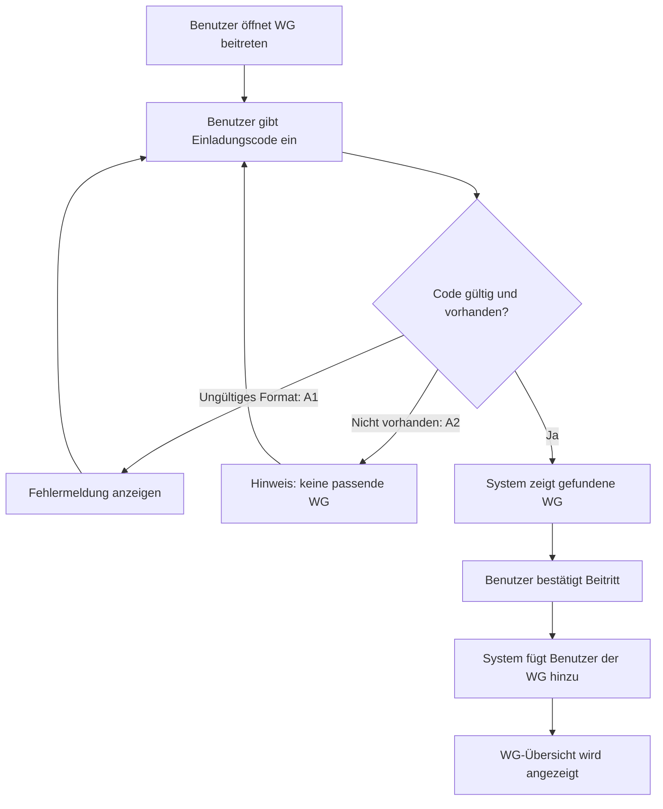
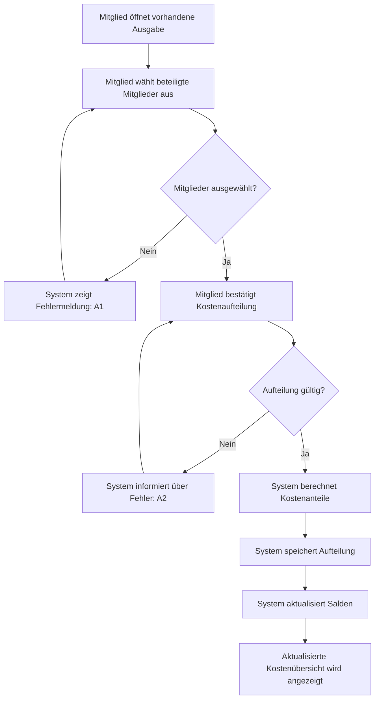

# F2 – Anwendungsfälle

F2 beschreibt die Anwendungsfälle von WG-ShopSync. Anwendungsfälle sind konkrete Interaktionsszenarien zwischen einem Benutzer und dem System, die jeweils ein benutzerrelevantes Ziel verfolgen und in einem stabilen Zustand enden.

Systeminterne Schritte ohne direkten Entscheidungspunkt des Benutzers, wie beispielsweise die Erzeugung eines Einladungscodes, die Berechnung von Kostenanteilen oder die Synchronisation von Daten, werden nicht als eigenständige Anwendungsfälle modelliert, sondern als Bestandteile bestehender Anwendungsfälle oder als Anwendungsfunktionen in F3 beschrieben.

---

## F2.1 Übersicht

Die folgende Tabelle ist konsistent mit dem Anwendungsfalldiagramm (`images/anwendungsfaelle-diagramm.png`) – beide verwenden dieselben 16 Anwendungsfälle mit identischen IDs und Titeln.

| ID | Anwendungsfall | Gruppe | Priorität |
|----|---------------|----------|----------|
| UC-01 | Registrieren | Authentifizierung | Hoch (MVP) |
| UC-02 | Einloggen | Authentifizierung | Hoch (MVP) |
| UC-03 | WG erstellen | WG-Verwaltung | Hoch (MVP) |
| UC-04 | WG beitreten | WG-Verwaltung | Hoch (MVP) |
| UC-05 | WG verlassen | WG-Verwaltung | Mittel |
| UC-06 | Artikel hinzufügen | Einkaufsliste | Hoch (MVP) |
| UC-07 | Artikel bearbeiten | Einkaufsliste | Mittel |
| UC-08 | Artikel löschen | Einkaufsliste | Mittel |
| UC-09 | Artikel als gekauft markieren | Einkaufsliste | Hoch (MVP) |
| UC-10 | Einkaufsliste anzeigen | Einkaufsliste | Hoch (MVP) |
| UC-11 | Ausgabe erfassen | Kostenverwaltung | Hoch (Bonus) |
| UC-12 | Ausgabe bearbeiten | Kostenverwaltung | Mittel |
| UC-13 | Kosten aufteilen | Kostenverwaltung | Hoch (Bonus) |
| UC-14 | Schulden anzeigen | Kostenverwaltung | Hoch (Bonus) |
| UC-15 | Schuld als bezahlt markieren | Kostenverwaltung | Hoch (Bonus) |
| UC-16 | Kostenübersicht anzeigen | Kostenverwaltung | Hoch (Bonus) |

---

# F2.2 Benutzer und Authentifizierung

## UC-01 – Registrieren

| Attribut | Beschreibung |
|-----------|-------------|
| ID | UC-01 |
| Name | Registrieren |
| Ziel | Ein neuer Benutzer erstellt ein Benutzerkonto für WG-ShopSync. |
| Akteur | Nicht registrierter Benutzer |
| Auslöser | Der Benutzer möchte WG-ShopSync erstmals nutzen. |
| Vorbedingung | Es existiert kein Benutzerkonto mit der verwendeten E-Mail-Adresse. |
| Nachbedingung | Das Benutzerkonto wurde erstellt und der Benutzer ist angemeldet. |

### Hauptszenario

1. Benutzer öffnet die Registrierung.
2. Benutzer gibt Name, E-Mail-Adresse und Passwort ein.
3. Benutzer bestätigt die Eingaben.
4. System prüft die Eingaben.
5. System erstellt das Benutzerkonto.
6. Benutzer wird angemeldet.

### Ausnahmeszenarien

- E-Mail-Adresse wird bereits verwendet.
- Passwort erfüllt die Anforderungen nicht.
- Keine Internetverbindung.

---

## UC-02 – Einloggen

| Attribut | Beschreibung |
|-----------|-------------|
| ID | UC-02 |
| Name | Einloggen |
| Ziel | Ein registrierter Benutzer meldet sich am System an. |
| Akteur | Benutzer |
| Auslöser | Der Benutzer möchte auf sein Konto zugreifen. |
| Vorbedingung | Ein Benutzerkonto existiert. |
| Nachbedingung | Der Benutzer ist erfolgreich angemeldet und erhält Zugriff auf seine WG-Daten. |

### Hauptszenario

1. Benutzer öffnet die Login-Seite.
2. Benutzer gibt E-Mail-Adresse und Passwort ein.
3. Benutzer tippt auf „Einloggen“.
4. System prüft die Zugangsdaten.
5. System meldet den Benutzer an.

### Ausnahmeszenarien

#### A1 - Falsche Zugangsdaten.

1 Benutzer gibt eine ungültige E-Mail-Adresse oder ein falsches Passwort ein.
2 System erkennt die ungültigen Zugangsdaten.
3 System zeigt eine Fehlermeldung an.
4 Benutzer kann die Eingaben korrigieren.
5 Benutzer versucht erneut, sich anzumelden.

---

# F2.3 WG-Verwaltung

## UC-03 – WG erstellen

| Attribut | Beschreibung |
|-----------|-------------|
| ID | UC-03 |
| Name | WG erstellen |
| Ziel | Ein angemeldeter Benutzer erstellt eine neue Wohngemeinschaft. |
| Akteur | Benutzer |
| Auslöser | Der Benutzer möchte eine neue WG anlegen. |
| Vorbedingung | Der Benutzer ist angemeldet. |
| Nachbedingung | Die WG wurde erstellt, der Benutzer ist Mitglied der WG und besitzt die Rolle „WG-Ersteller“. |

### Hauptszenario

1. Benutzer wählt „WG erstellen“.
2. Benutzer gibt einen WG-Namen ein.
3. Benutzer bestätigt die Eingabe.
4. System erstellt die WG.
5. System erzeugt einen Einladungscode.
6. Benutzer gelangt zur WG-Ansicht.

### Ausnahmeszenarien

#### A1 – Ungültiger WG-Name

1 Benutzer gibt keinen oder einen ungültigen WG-Namen ein. 
2 System erkennt die fehlerhafte Eingabe. 
3 System zeigt eine Fehlermeldung an. 
4 Benutzer korrigiert die Eingabe.

#### A2 – Technischer Fehler

1 Das System kann die WG nicht anlegen.
2 System zeigt eine Fehlermeldung an.
3 Der Benutzer kann den Vorgang erneut ausführen.

---

## UC-04 – WG beitreten

| Attribut | Beschreibung |
|-----------|-------------|
| ID | UC-04 |
| Name | WG beitreten |
| Ziel | Ein angemeldeter Benutzer tritt einer bestehenden Wohngemeinschaft bei. |
| Akteur | Benutzer |
| Auslöser | Der Benutzer besitzt einen Einladungscode einer bestehenden WG. |
| Vorbedingung | Eine WG mit gültigem Einladungscode existiert. |
| Nachbedingung | Der Benutzer ist Mitglied der WG und hat Zugriff auf die gemeinsamen Daten der WG. |

### Hauptszenario

1. Benutzer öffnet „WG beitreten“.
2. Benutzer gibt den Einladungscode ein.
3. System prüft den Code.
4. System zeigt die gefundene WG an.
5. Benutzer bestätigt den Beitritt.
6. System fügt den Benutzer der WG hinzu.
7. Die WG-Übersicht wird angezeigt.

### Ausnahmeszenarien

#### A1 - Einladungscode ungültig.

Benutzer gibt einen ungültigen Einladungscode ein. 
System erkennt den ungültigen Code.
System zeigt eine Fehlermeldung an.
Benutzer kann einen anderen Code eingeben.

#### A2 - Einladungscode nicht vorhanden.

Benutzer gibt einen nicht existierenden Einladungscode ein.
System findet keine passende WG.
System informiert den Benutzer darüber.
Benutzer kann die Eingabe korrigieren oder den Vorgang abbrechen.

### Aktivitätsdiagramm – UC-04 WG beitreten

---

## UC-05 – WG verlassen

| Attribut | Beschreibung |
|-----------|-------------|
| ID | UC-05 |
| Name | WG verlassen |
| Ziel | Ein Mitglied verlässt eine bestehende Wohngemeinschaft. |
| Akteur | Benutzer |
| Auslöser | Das Mitglied möchte die Wohngemeinschaft verlassen. |
| Vorbedingung | Der Benutzer ist Mitglied einer Wohngemeinschaft. |
| Nachbedingung | Die Mitgliedschaft wurde entfernt und der Benutzer hat keinen Zugriff mehr auf die WG-Daten. |

### Hauptszenario

1. Mitglied öffnet die WG-Einstellungen.
2. Mitglied wählt „WG verlassen“.
3. System zeigt eine Bestätigung.
4. Mitglied bestätigt.
5. System entfernt die Mitgliedschaft.

### Ausnahmeszenarien

#### A1 – Vorgang abgebrochen

System zeigt die Sicherheitsabfrage an.
Mitglied entscheidet sich gegen das Verlassen der WG.
Mitglied bricht den Vorgang ab.
Die Mitgliedschaft bleibt unverändert bestehen.

---

# F2.4 Einkaufsliste

## UC-06 – Artikel hinzufügen

| Attribut | Beschreibung |
|-----------|-------------|
| ID | UC-06 |
| Name | Artikel hinzufügen |
| Ziel | Ein Mitglied fügt einen neuen Artikel zur gemeinsamen Einkaufsliste hinzu. |
| Akteur | Benutzer |
| Auslöser | Ein Produkt wird benötigt. |
| Vorbedingung | Der Benutzer ist Mitglied einer Wohngemeinschaft. |
| Nachbedingung | Der Artikel wurde gespeichert und erscheint auf der Einkaufsliste. |

### Hauptszenario

1. Mitglied öffnet die Einkaufsliste.
2. Mitglied wählt „Artikel hinzufügen“.
3. Mitglied gibt Name, Menge und Kategorie ein.
4. Mitglied bestätigt die Eingabe.
5. System speichert den Artikel.

### Ausnahmeszenarien

#### A1 – Pflichtfeld fehlt

Mitglied gibt keinen Artikelnamen ein.
System erkennt die unvollständige Eingabe.
System zeigt eine Fehlermeldung an.
Mitglied ergänzt die fehlenden Angaben.

---

## UC-07 – Artikel bearbeiten

| Attribut | Beschreibung |
|-----------|-------------|
| ID | UC-07 |
| Name | Artikel bearbeiten |
| Ziel | Ein Mitglied ändert die Informationen eines vorhandenen Artikels. |
| Akteur | Benutzer |
| Auslöser | Die Informationen eines Artikels sollen geändert werden. |
| Vorbedingung | Der Artikel existiert auf der Einkaufsliste. |
| Nachbedingung | Die Änderungen wurden gespeichert und sind für die Mitglieder sichtbar. |

### Hauptszenario

1. Mitglied wählt einen Artikel aus.
2. Mitglied bearbeitet die Daten.
3. Mitglied speichert die Änderungen.
4. System aktualisiert den Artikel.

### Ausnahmeszenarien

#### A2 – Artikel wurde zwischenzeitlich geändert

Während der Bearbeitung wurde der Artikel von einem anderen Mitglied geändert.
System erkennt den Konflikt.
System aktualisiert die angezeigten Daten oder fordert eine erneute Bearbeitung an.

---

## UC-08 – Artikel löschen

| Attribut | Beschreibung |
|-----------|-------------|
| ID | UC-08 |
| Name | Artikel löschen |
| Ziel | Ein Mitglied entfernt einen nicht mehr benötigten Artikel aus der gemeinsamen Einkaufsliste. |
| Akteur | Benutzer |
| Auslöser | Der Artikel wird nicht mehr benötigt. |
| Vorbedingung | Der Artikel existiert auf der Einkaufsliste. |
| Nachbedingung | Der Artikel wurde entfernt und erscheint nicht mehr auf der Einkaufsliste. |

### Hauptszenario

1. Mitglied wählt einen Artikel aus.
2. Mitglied wählt „Löschen“.
3. System zeigt eine Bestätigung.
4. Mitglied bestätigt.
5. System löscht den Artikel.

### Ausnahmeszenarien

#### A1 – Löschvorgang abgebrochen

System zeigt die Sicherheitsabfrage an. 
Mitglied entscheidet sich gegen das Löschen.
Mitglied bricht den Vorgang ab.
Der Artikel bleibt unverändert bestehen.

#### A2 – Artikel wurde bereits gelöscht

Ein anderes Mitglied hat den Artikel bereits gelöscht.
System erkennt, dass der Artikel nicht mehr existiert.
System informiert das Mitglied über die Änderung.
Die aktuelle Einkaufsliste wird angezeigt.

---

## UC-09 – Artikel als gekauft markieren

| Attribut | Beschreibung |
|-----------|-------------|
| ID | UC-09 |
| Name | Artikel als gekauft markieren |
| Ziel | Ein Mitglied kennzeichnet einen Artikel als gekauft, damit alle Mitglieder den aktuellen Einkaufsstand sehen können. |
| Akteur | Benutzer |
| Auslöser | Der Artikel wurde eingekauft. |
| Vorbedingung | Der Artikel existiert und besitzt den Status „Offen“. |
| Nachbedingung | Der Artikel besitzt den Status „Gekauft“. |

### Hauptszenario

1. Mitglied öffnet die Einkaufsliste.
2. Mitglied markiert einen Artikel.
3. System setzt den Status auf „Gekauft“.
4. System aktualisiert die Liste.

### Ausnahmeszenarien

#### A1 – Artikel wurde bereits als gekauft markiert

Mitglied versucht einen bereits gekauften Artikel erneut zu markieren.
System erkennt den aktuellen Status.
Es erfolgt keine weitere Änderung.
Der aktuelle Artikelstatus wird angezeigt.

#### A2 – Artikel nicht verfügbar

Mitglied wählt einen Artikel aus.
Der Artikel wurde zwischenzeitlich gelöscht oder verändert.
System informiert das Mitglied über die Änderung.
Die aktuelle Einkaufsliste wird neu geladen.

---

## UC-10 – Einkaufsliste anzeigen

| Attribut | Beschreibung |
|-----------|-------------|
| ID | UC-10 |
| Name | Einkaufsliste anzeigen |
| Ziel | Ein Mitglied zeigt die aktuelle Einkaufsliste seiner Wohngemeinschaft an. |
| Akteur | Benutzer |
| Auslöser | Das Mitglied möchte offene oder bereits gekaufte Artikel einsehen. |
| Vorbedingung | Der Benutzer ist Mitglied einer Wohngemeinschaft. |
| Nachbedingung | Die Einkaufsliste wird angezeigt. |

### Hauptszenario

1. Mitglied öffnet die Einkaufsliste.
2. System lädt die vorhandenen Artikel.
3. System zeigt die Liste an.

### Ausnahmeszenarien

#### A1 – Keine Artikel vorhanden

Mitglied öffnet die Einkaufsliste.
System findet keine Artikel.
System zeigt eine leere Einkaufsliste an.
Mitglied kann neue Artikel hinzufügen.

#### A2 – Daten können nicht geladen werden

Mitglied öffnet die Einkaufsliste.
Während des Ladevorgangs tritt ein Fehler auf.
System zeigt eine Fehlermeldung an.
Mitglied kann den Ladevorgang erneut starten.

---

# F2.5 Kostenverwaltung

## UC-11 – Ausgabe erfassen

| Attribut | Beschreibung |
|-----------|-------------|
| ID | UC-11 |
| Name | Ausgabe erfassen |
| Ziel | Ein Mitglied erfasst eine gemeinsame Ausgabe der Wohngemeinschaft. |
| Akteur | Benutzer |
| Auslöser | Ein Mitglied hat einen Einkauf oder eine gemeinsame Ausgabe bezahlt. |
| Vorbedingung | Der Benutzer ist Mitglied einer Wohngemeinschaft. |
| Nachbedingung | Die Ausgabe wurde gespeichert und steht für die Kostenaufteilung zur Verfügung. |

### Hauptszenario

1. Mitglied öffnet den Bereich „Ausgaben“.
2. Mitglied erstellt eine neue Ausgabe.
3. Mitglied gibt Betrag und Beschreibung ein.
4. Mitglied wählt die beteiligten Mitglieder.
5. System speichert die Ausgabe.

### Ausnahmeszenarien

#### A1 – Keine beteiligten Mitglieder ausgewählt

Mitglied erfasst die Ausgabe ohne beteiligte Mitglieder auszuwählen.
System erkennt die unvollständigen Angaben.
System informiert das Mitglied über den Fehler.
Mitglied ergänzt die fehlenden Angaben.

---

## UC-12 – Ausgabe bearbeiten

| Attribut | Beschreibung |
|-----------|-------------|
| ID | UC-12 |
| Name | Ausgabe bearbeiten |
| Ziel | Ein Mitglied ändert die Informationen einer bestehenden Ausgabe. |
| Akteur | Benutzer |
| Auslöser | Fehlerhafte oder unvollständige Angaben einer Ausgabe sollen korrigiert werden. |
| Vorbedingung | Die Ausgabe existiert und kann bearbeitet werden. |
| Nachbedingung | Die Ausgabe wurde aktualisiert und die Änderungen sind gespeichert. |

### Hauptszenario

1. Mitglied öffnet eine Ausgabe.
2. Mitglied bearbeitet die Daten.
3. Mitglied speichert die Änderungen.
4. System aktualisiert die Ausgabe.

### Ausnahmeszenarien

#### A1 – Ausgabe wurde zwischenzeitlich geändert

Während der Bearbeitung wurde die Ausgabe von einem anderen Mitglied geändert.
System erkennt die Änderung.
System informiert das Mitglied über den Konflikt.
Mitglied kann die Bearbeitung erneut durchführen.

---

## UC-13 – Kosten aufteilen

| Attribut | Beschreibung |
|-----------|-------------|
| ID | UC-13 |
| Name | Kosten aufteilen |
| Ziel | Eine gemeinsame Ausgabe wird auf alle oder ausgewählte Mitglieder der Wohngemeinschaft verteilt. |
| Akteur | Benutzer |
| Auslöser | Eine Ausgabe wurde erfasst und soll auf die beteiligten Mitglieder aufgeteilt werden. |
| Vorbedingung | Eine Ausgabe existiert. |
| Nachbedingung | Die Kostenanteile wurden berechnet und gespeichert. |

### Hauptszenario

1. Mitglied öffnet eine Ausgabe.
2. Mitglied wählt die beteiligten Mitglieder aus.
3. System berechnet die Anteile.
4. System speichert die Aufteilung.
5. System aktualisiert die Salden.

### Ausnahmeszenarien

#### A1 – Keine beteiligten Mitglieder ausgewählt

Mitglied startet die Kostenaufteilung ohne Mitglieder auszuwählen.
System erkennt die unvollständigen Angaben.
System zeigt eine Fehlermeldung an.
Mitglied ergänzt die fehlenden Angaben.

#### A2 – Ungültige Kostenaufteilung

Die eingegebenen Daten lassen keine gültige Kostenaufteilung zu.
System erkennt die fehlerhaften Angaben.
System informiert das Mitglied über den Fehler.
Mitglied korrigiert die Eingaben.

### Aktivitätsdiagramm – UC-13 Kosten aufteilen

---

## UC-14 – Schulden anzeigen

| Attribut | Beschreibung |
|-----------|-------------|
| ID | UC-14 |
| Name | Schulden anzeigen |
| Ziel | Ein Mitglied zeigt seine offenen und bereits beglichenen Schulden innerhalb der Wohngemeinschaft an. |
| Akteur | Benutzer |
| Auslöser | Das Mitglied möchte seine Verbindlichkeiten und Forderungen prüfen. |
| Vorbedingung | Mindestens eine Kostenaufteilung existiert. |
| Nachbedingung | Die Schuldenübersicht wird angezeigt. |

### Hauptszenario

1. Mitglied öffnet die Schuldenübersicht.
2. System lädt die Schulden.
3. System zeigt Betrag, Gläubiger und Status an.

### Ausnahmeszenarien

#### A1 – Keine Schulden vorhanden

Mitglied öffnet die Schuldenübersicht.
System findet keine offenen oder bezahlten Schulden.
System informiert das Mitglied darüber.
Eine leere Schuldenübersicht wird angezeigt.

#### A2 – Daten können nicht geladen werden

Mitglied öffnet die Schuldenübersicht.
Während des Ladevorgangs tritt ein Fehler auf.
System zeigt eine Fehlermeldung an.
Mitglied kann den Ladevorgang erneut starten.

---

## UC-15 – Schuld als bezahlt markieren

| Attribut | Beschreibung |
|-----------|-------------|
| ID | UC-15 |
| Name | Schuld als bezahlt markieren |
| Ziel | Ein Mitglied markiert eine offene Schuld als beglichen. |
| Akteur | Benutzer |
| Auslöser | Die offene Schuld wurde außerhalb des Systems beglichen. |
| Vorbedingung | Eine offene Schuld existiert. |
| Nachbedingung | Die Schuld besitzt den Status „Bezahlt“ und wird entsprechend angezeigt. |

### Hauptszenario

1. Mitglied öffnet die Schuldenübersicht.
2. Mitglied wählt eine Schuld aus.
3. Mitglied tippt auf „Als bezahlt markieren“.
4. System setzt den Status auf „Bezahlt“.
5. System speichert das Zahlungsdatum.

### Ausnahmeszenarien

#### A1 – Vorgang abgebrochen

System zeigt die Bestätigung an.
Mitglied entscheidet sich gegen die Änderung.
Mitglied bricht den Vorgang ab.
Die Schuld bleibt weiterhin offen.

#### A2 – Schuld wurde bereits beglichen

Mitglied wählt eine bereits als bezahlt markierte Schuld aus.
System erkennt den aktuellen Status.
Es erfolgt keine weitere Änderung.
Die aktuelle Schuldenübersicht wird angezeigt.

---

## UC-16 – Kostenübersicht anzeigen

| Attribut | Beschreibung |
|-----------|-------------|
| ID | UC-16 |
| Name | Kostenübersicht anzeigen |
| Ziel | Ein Mitglied betrachtet die finanzielle Situation der Wohngemeinschaft. |
| Akteur | Benutzer |
| Auslöser | Das Mitglied möchte Ausgaben, Kostenanteile und Salden prüfen. |
| Vorbedingung | Mindestens eine Ausgabe existiert. |
| Nachbedingung | Die Kostenübersicht wird angezeigt. |

### Hauptszenario

1. Mitglied öffnet die Kostenübersicht.
2. System zeigt alle Ausgaben an.
3. System zeigt die aktuellen Salden an.
4. System zeigt offene und bezahlte Schulden an.
5. Mitglied kann Detailinformationen aufrufen.

6. 
### Ausnahmeszenarien

#### A1 – Keine Ausgaben vorhanden

Mitglied öffnet die Kostenübersicht.
System findet keine erfassten Ausgaben.
System informiert das Mitglied darüber.
Eine leere Kostenübersicht wird angezeigt.

#### A2 – Daten können nicht geladen werden

Mitglied öffnet die Kostenübersicht.
Während des Ladevorgangs tritt ein Fehler auf.
System zeigt eine Fehlermeldung an.
Mitglied kann die Ansicht erneut laden.

---

## F2.6 Allgemeine Ausnahmeszenarien

Die folgenden Ausnahmeszenarien gelten grundsätzlich für alle Anwendungsfälle, sofern nicht anders angegeben.

### A-G01 – Keine Internetverbindung

1. Der Benutzer startet einen Anwendungsfall.
2. Das System erkennt die fehlende Internetverbindung.
3. Das System informiert den Benutzer über die fehlende Verbindung.
4. Änderungen werden lokal gespeichert oder nach Wiederherstellung der Verbindung synchronisiert.

### A-G02 – Technischer Fehler

1. Während der Ausführung eines Anwendungsfalls tritt ein technischer Fehler auf.
2. Das System zeigt eine Fehlermeldung an.
3. Der Benutzer kann den Vorgang zu einem späteren Zeitpunkt erneut durchführen.

### A-G03 – Ungültige Eingaben

1. Der Benutzer gibt ungültige oder unvollständige Daten ein.
2. Das System erkennt die fehlerhaften Eingaben.
3. Das System informiert den Benutzer über die Fehler.
4. Der Benutzer korrigiert die Eingaben.

