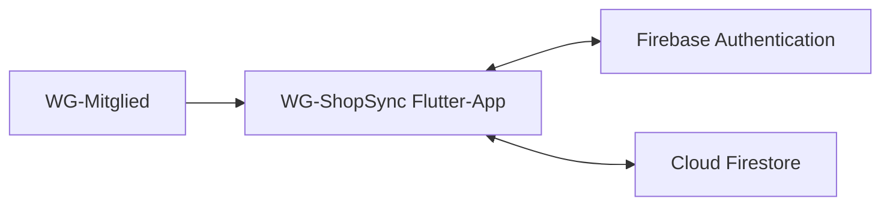

# P2 – Architekturüberblick

Dieser Baustein beschreibt die Einbettung von WG-ShopSync in seine Systemumgebung.

Ziel dieses Dokuments ist die Beschreibung der beteiligten Systeme sowie der Kommunikationsbeziehungen zwischen diesen Systemen.

Detaillierte Architekturentscheidungen, interne Komponenten, APIs oder Datenbankstrukturen sind nicht Bestandteil dieses Dokuments und werden in späteren Architekturartefakten dokumentiert.

---

## P2.1 Systemkontext

WG-ShopSync besteht aus einer plattformübergreifenden Client-Anwendung und den direkt angebundenen Firebase-Diensten.

Benutzer greifen über Smartphone, Tablet oder Webbrowser auf die Anwendung zu.

Die Flutter-Anwendung verwendet das Firebase Authentication SDK für Benutzerkonten und das Cloud-Firestore-SDK für Datenzugriff, Echtzeit-Listener und Offline-Persistenz.

Die zentrale Datenhaltung speichert alle Informationen zu Benutzern, Wohngemeinschaften, Einkaufslisten und Ausgaben.

---

## P2.2 Nachbarsysteme

Vollständige Übersicht aller Systeme, mit denen WG-ShopSync kommuniziert.

| ID | System | Rolle | Richtung | Kopplung |
|----|---------|---------|-----------|-----------|
| NB-01 |Firebase Authentication | Registrierung und Anmeldung von Benutzern | Bidirektional | Direkt |
| NB-02 |Cloud Firestore | Speicherung und Synchronisation von Anwendungsdaten | Bidirektional | Direkt |

---

## Hinweise

- Firebase Authentication wird für die Benutzeranmeldung verwendet.
- Cloud Firestore dient als zentrale Datenhaltung.
- Schnittstellen und Kommunikationsdetails werden im Baustein S1 behandelt.
- Das System ist als Greenfield-Projekt konzipiert und besitzt keine Altsysteme.
