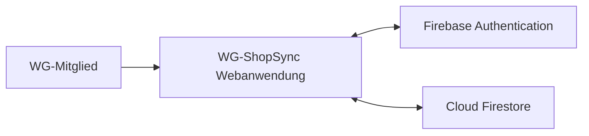

# P2 – Architekturüberblick

Dieser Baustein beschreibt die Einbettung von WG-ShopSync in seine Systemumgebung.

Ziel dieses Dokuments ist die Beschreibung der Systemumgebung und der technischen Infrastruktur von WG-ShopSync. Firebase wird dabei als verwaltete Cloud-Infrastruktur und nicht als fachliches Nachbarsystem betrachtet.

Detaillierte Architekturentscheidungen, interne Komponenten, APIs oder Datenbankstrukturen sind nicht Bestandteil dieses Dokuments und werden in späteren Architekturartefakten dokumentiert.

---

## P2.1 Systemkontext und Cloud-Infrastruktur

WG-ShopSync besteht aus einer browserbasierten Webanwendung und den direkt angebundenen Firebase-Diensten.

Benutzer greifen über einen modernen Desktop- oder mobilen Webbrowser auf die Anwendung zu.

Die Webanwendung verwendet die Firebase-SDKs für Benutzerkonten, Datenzugriff, Echtzeit-Listener und Offline-Persistenz. Die Webanwendung ist der einzige von WG-ShopSync selbst entwickelte Anwendungsknoten; Firebase stellt die verwalteten Infrastrukturbausteine bereit.

Die zentrale Datenhaltung speichert Benutzer, Wohngemeinschaften, Memberships, Einkaufslisten, Ausgaben, Kostenanteile und Schulden. Die fachliche Struktur und die Beziehungen sind in [D1 – Datenmodell](D1-datenmodell.md) beschrieben; die fachlichen Datentypen und Kardinalitäten der Attribute stehen in [D2 – Datentypen](D2-datentypen.md).

---

## P2.2 Fachliche Systemgrenze

WG-ShopSync besitzt im definierten Projektumfang kein fachliches Nachbarsystem, beispielsweise keinen Online-Shop, Zahlungsdienst oder externen Einkaufsdienst. Der tatsächliche Einkauf und die Zahlung liegen außerhalb der Systemgrenze.

Firebase Authentication und Cloud Firestore sind technische, verwaltete Cloud-Dienste. Ihre Aufgaben, Daten und Schnittstellen werden in [S1 – Technische Infrastruktur](S1-nachbarsysteme.md) sowie in der Architekturdokumentation beschrieben.

---

## Hinweise

- Firebase Authentication wird für die Benutzeranmeldung verwendet.
- Cloud Firestore dient als zentrale Datenhaltung.
- Technische Infrastruktur und Kommunikationsdetails werden im Baustein S1 behandelt.
- Das System ist als Greenfield-Projekt konzipiert und besitzt keine Altsysteme.
