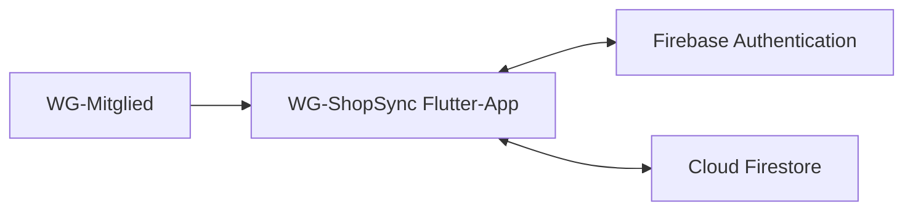

# WG-ShopSync – Gesamtspezifikation

## 1. Zweck und Geltungsbereich

WG-ShopSync ist eine plattformübergreifende Anwendung zur Organisation gemeinsamer Einkäufe und Ausgaben in Wohngemeinschaften. Diese Spezifikation beschreibt die fachlichen Anforderungen, die Benutzeroberfläche, das Datenmodell, die Systemumgebung und die Qualitätsanforderungen. Sie ist die verbindliche Grundlage für Architektur, Implementierung, Tests und Abnahme im Projekt WK_1106.

**Projekt:** WG-ShopSync  
**Technologien:** Flutter, Firebase Authentication, Cloud Firestore  
**Zielplattformen:** Android, iOS und Webbrowser  
**Status:** Arbeitsgrundlage für Entwicklung und Test

## 2. Produktvision

WG-Mitglieder sollen eine gemeinsame, aktuelle Einkaufsliste nutzen und gemeinsame Ausgaben transparent erfassen können. Die Anwendung reduziert Doppelkäufe und vergessene Einkäufe, berechnet Kostenanteile und zeigt offene Schulden. Eine tatsächliche Zahlung wird nicht durchgeführt.

## 3. Funktionsumfang

### 3.1 Enthaltene Funktionen

- Benutzer registrieren und einloggen
- WG erstellen und über einen Einladungscode beitreten
- WG verlassen
- Gemeinsame Einkaufsliste anzeigen
- Artikel mit Name, Menge, Kategorie und optionaler Beschreibung hinzufügen
- Artikel bearbeiten und löschen
- Artikel als gekauft markieren
- Änderungen nahezu in Echtzeit synchronisieren
- Gemeinsame Ausgaben erfassen und bearbeiten
- Kosten auf alle oder ausgewählte Mitglieder aufteilen
- Kostenübersicht, Salden und Schulden anzeigen
- Schulden als bezahlt markieren
- Bereits synchronisierte Kerninhalte offline anzeigen und Änderungen später synchronisieren

### 3.2 Nicht enthaltene Funktionen

- Zahlungsabwicklung, Banküberweisungen oder Finanzdienstleister
- Preisvergleich und Anbindung an Supermärkte oder Online-Shops
- Automatische Bon-Erkennung
- Push-Benachrichtigungen
- Private Einkaufslisten
- Mehrere WGs pro Benutzer in der ersten Version

## 4. Benutzer, Rollen und Rechte

| Rolle | Rechte |
|---|---|
| Nicht angemeldeter Benutzer | Registrierung und Login |
| `admin` / WG-Ersteller | WG erstellen, Einladungscode anzeigen und Mitgliederverwaltung gemäß den Use Cases durchführen. Der letzte Admin darf die WG nicht verlassen. |
| `member` | Einkaufsliste und Ausgaben der eigenen WG verwalten, Kostenübersicht und Schulden einsehen, Schulden als bezahlt markieren und die WG verlassen. |

Ein Benutzer darf ausschließlich auf Daten von WGs zugreifen, deren Mitglied er ist. Die Rolle wird in `Membership.role` gespeichert.

## 5. Fachliche Geschäftsregeln

| ID | Regel |
|---|---|
| BR-01 | Jeder Benutzer besitzt eine eindeutige E-Mail-Adresse. |
| BR-02 | In der ersten Version kann ein Benutzer gleichzeitig nur einer WG angehören. |
| BR-03 | Jede WG besitzt einen systemweit eindeutigen Einladungscode. |
| BR-04 | Neue Einkaufsartikel erhalten den Status `open`. |
| BR-05 | Ein Artikel kann von `open` nach `bought` wechseln. |
| BR-06 | Der Betrag einer Ausgabe muss größer als 0 sein. |
| BR-07 | Eine Kostenaufteilung benötigt mindestens ein beteiligtes Mitglied. |
| BR-08 | Die Summe aller Kostenanteile muss exakt dem Gesamtbetrag entsprechen; Rundungsdifferenzen werden ausgeglichen. |
| BR-09 | Der Zahlende einer Ausgabe muss Mitglied der betreffenden WG sein. |
| BR-10 | Schuldner und Gläubiger einer Schuld dürfen nicht identisch sein. |
| BR-11 | Eine als bezahlt markierte Schuld erhält den gespeicherten Status `paid` und wird nicht mehr als offene Schuld angezeigt. |
| BR-12 | Die Anwendung dokumentiert Zahlungen nur; sie führt keine Zahlung aus. |
| BR-13 | Bei konkurrierenden Änderungen besitzt der serverseitige Datenstand Vorrang; die lokale Änderung bleibt als Konflikthinweis zur erneuten Anwendung erhalten. |

## 6. Validierung und Fehlerverhalten

| Objekt | Pflicht- und Validierungsregeln |
|---|---|
| Benutzer | Name nicht leer, gültige E-Mail, Passwort gemäß Firebase-Anforderungen |
| WG | Name nicht leer, Einladungscode automatisch erzeugt und eindeutig |
| Einkaufseintrag | Name 1–100 Zeichen, Beschreibung optional bis 500 Zeichen, Menge bei Angabe positive Ganzzahl, Kategorie aus erlaubter Auswahl |
| Ausgabe | Betrag positiv, Beschreibung nicht leer, Zahlender und Beteiligte sind WG-Mitglieder |
| Kostenanteil | Nicht negativ, Summe entspricht dem Ausgabebetrag |
| Einladungscode | Genau sechs alphanumerische Zeichen, gültig solange die WG besteht |

Validierungs-, Authentifizierungs-, Netzwerk- und Synchronisationsfehler werden verständlich angezeigt. Der Benutzer erhält, soweit möglich, eine konkrete Korrektur- oder Wiederholungsaktion. Nicht synchronisierte lokale Änderungen dürfen bei einem Fehler nicht stillschweigend verloren gehen.

## 7. Systemgrenze und Nachbarsysteme



Die Flutter-App bildet die Benutzerschnittstelle und die lokale Offline-Nutzung ab. Firebase Authentication verwaltet Konten und Sitzungen. Cloud Firestore speichert WG-Daten und synchronisiert Änderungen. Der tatsächliche Einkauf und die tatsächliche Geldzahlung liegen außerhalb der Systemgrenze.

## 8. Dokumentübersicht

### Produktsicht

- [P1 – Ziele und Rahmenbedingungen](P1-ziele-rahmenbedingungen.md)
- [P1 – Projektbeschränkungen](P1-constraints.md)
- [P2 – Architekturüberblick](P2-architektur.md)

### Fachliche Sicht

- [F1 – Geschäftsprozesse](F1-geschaeftsprozesse.md)
- [F2 – Anwendungsfälle](F2-anwendungsfaelle.md)
- [F3 – Anwendungsfunktionen](F3-anwendungsfunktionen.md)

### Benutzerschnittstelle

- [B1 – Dialogspezifikation](B1-dialogspezifikation.md)

### Daten

- [D1 – Datenmodell](D1-datenmodell.md)
- [D2 – Datentypen](D2-datentypen.md)

### Systemumgebung und Qualität

- [S1 – Nachbarsysteme](S1-nachbarsysteme.md)
- [S3 – Inbetriebnahme](S3-inbetriebnahme.md)
- [N1 – Nichtfunktionale Anforderungen](N1-nichtfunktional-anforderungen.md)
- [N2 – Querschnittskonzepte](N2-querschnittskonzepte.md)

### Ergänzende Dokumente

- [E1 – Leseanleitung](E1-leseanleitung.md)
- [E2 – Glossar](E2-glossar.md)
- [E3 – Eingesetzte KI-Werkzeuge](E3-eingesetzte-ki-werkzeuge.md)

## 9. Grafiken und Modelle

- [Datenmodellbild (Bestand)](images/anwendungsfaelle-diagramm.png)
- [Informationsmodell (Bestand)](images/Information-Model.png)
- [Navigationsdiagramm](images/navigationsdiagramm.png)
- Architekturdiagramm: [P2 – Architekturüberblick](P2-architektur.md)
- GUI-Mockups: [B1 – Dialogspezifikation](B1-dialogspezifikation.md)

## 10. Anforderungen und Nachweise

| Anforderungsbereich | Spezifikation | Nachweis |
|---|---|---|
| Authentifizierung | UC-01, UC-02; BR-01; N2.1 | Registrierungs- und Login-Test |
| WG-Verwaltung | UC-03 bis UC-05; BR-02, BR-03; N2.2 | WG-Erstellungs-, Beitritts- und Verlassen-Test |
| Einkaufsliste | UC-06 bis UC-10; BR-04, BR-05 | CRUD-, Status- und Synchronisationstest |
| Kostenverwaltung | UC-11 bis UC-16; BR-06 bis BR-12 | Berechnungs- und Schuldenstatus-Test |
| Datenschutz und Zugriff | N1.2; N2.2, N2.7 | Autorisierungs- und Security-Rules-Test |
| Offline und Synchronisation | BR-13; N1.3-03; N2.3, N2.4 | Offline-/Reconnect- und Konflikttest |
| Bedienbarkeit | N1.4 | Usability-Test mit typischen WG-Szenarien |

## 11. Qualitätsziele

- Änderungen der Einkaufsliste werden bei bestehender Verbindung innerhalb von zwei Sekunden sichtbar.
- Anmeldung und Speichern erfolgen ohne unnötige Verzögerung; die Zielwerte stehen in [N1](N1-nichtfunktional-anforderungen.md).
- Nur authentifizierte WG-Mitglieder können geschützte Daten lesen oder verändern.
- Android, iOS und Webbrowser unterstützen die Kernfunktionen.
- Offline verfügbare Daten und lokale Änderungen werden nach einer Wiederverbindung synchronisiert.
- Fehlermeldungen sind verständlich und enthalten eine Handlungsempfehlung.

## 12. Abnahmebasis

Die erste Version gilt als fachlich abnahmefähig, wenn mindestens folgende Szenarien erfolgreich durchlaufen werden:

1. Ein Benutzer registriert sich, loggt sich ein und erstellt eine WG.
2. Ein zweiter Benutzer tritt über den Einladungscode bei.
3. Beide Benutzer sehen denselben neuen Einkaufsartikel und dessen Statusänderung.
4. Ein Mitglied erfasst eine Ausgabe und teilt sie auf ausgewählte Mitglieder auf.
5. Die berechneten Anteile ergeben in Summe den Ausgabebetrag.
6. Die entstehende Schuld wird angezeigt und kann als bezahlt markiert werden.
7. Ein Zugriff auf Daten einer fremden WG wird verhindert.
8. Eine offline vorgenommene Listenänderung wird nach Wiederherstellung der Verbindung übernommen.

## 13. Annahmen, Risiken und offene Entscheidungen

### Annahmen

- Benutzer verfügen über ein internetfähiges Endgerät.
- Mitglieder erfassen Ausgaben vollständig und korrekt.
- Firebase-Dienste sind für Entwicklung und Betrieb verfügbar.
- Die Kostenaufteilung dient nur der Übersicht.

### Risiken

- Die vollständige Umsetzung der Kostenverwaltung kann die verfügbare Projektzeit überschreiten.
- Offline-Konflikte können zu zusätzlicher Implementierungs- und Testarbeit führen.
- Fehlende Firebase-Sicherheitsregeln würden den Datenzugriff unzulässig erweitern.

### Verbindliche Umsetzungsentscheidungen

- Die erste Version erlaubt höchstens eine WG-Mitgliedschaft pro Benutzer.
- Jedes WG-Mitglied darf Ausgaben bearbeiten; der Zugriff ist auf die eigene WG beschränkt.
- Der Einladungscode bleibt dauerhaft gültig und wird nicht regeneriert.
- Gekaufte Artikel bleiben mit dem Status `bought` in der Liste sichtbar.
- Schulden werden als WG-gebundene Datensätze aus Ausgaben und Kostenanteilen abgeleitet und für den Zahlungsstatus persistiert.

## 14. Abhängigkeiten zwischen den Dokumenten

```text
P1 Ziele und Rahmenbedingungen
  -> F1 Geschäftsprozesse
  -> F2 Anwendungsfälle
  -> F3 Anwendungsfunktionen
  -> B1 Dialogspezifikation

F2 und F3 -> D1 Datenmodell -> D2 Datentypen
P2 Architekturüberblick -> S1 Nachbarsysteme -> S3 Inbetriebnahme
N1 Nichtfunktionale Anforderungen -> N2 Querschnittskonzepte
```

Die Einzelkapitel enthalten die ausführlichen Beschreibungen. Dieses Dokument dient als Einstieg, gemeinsamer Begriffsrahmen und Konsistenzanker der Gesamtspezifikation.
