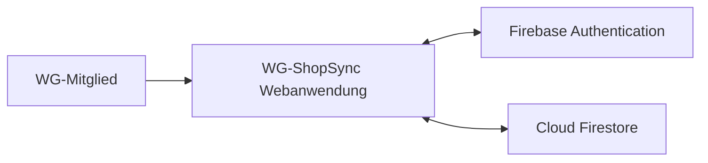

# S1 – Technische Infrastruktur

## Übersicht

| ID | Infrastrukturbaustein | Zweck | Richtung |
|----|---------------|-------|----------|
| INF-01 | Firebase Authentication | Registrierung und Anmeldung von Benutzern | bidirektional |
| INF-02 | Cloud Firestore | Speicherung und Echtzeit-Synchronisation der WG-Daten | bidirektional |

---

## INF-01 – Firebase Authentication

### Zweck

Firebase Authentication ist ein verwalteter technischer Dienst und kein fachliches Nachbarsystem.

Es stellt Funktionen zur Registrierung, Anmeldung und Verwaltung von Benutzerkonten bereit.

### Verwendet von

- UC-01 Registrieren
- UC-02 Einloggen

### Ausgetauschte Informationen

- E-Mail-Adresse
- Passwort bzw. Authentifizierungsdaten
- Benutzer-ID
- Authentifizierungsstatus

### Schnittstelle

- Firebase Authentication SDK

---

## INF-02 – Cloud Firestore

### Zweck

Cloud Firestore ist ein verwalteter technischer Dienst für die zentrale Speicherung und Synchronisation der Anwendungsdaten.

### Verwendet von

- UC-03 bis UC-16
- AF-01 bis AF-06
- N2.3 Offline-Modus
- N2.4 Synchronisation

### Ausgetauschte Informationen

- WG- und Mitgliedschaftsdaten
- Einkaufslistenartikel
- Ausgaben und Kostenanteile
- Schulden und Zahlungsstatus

### Schnittstelle

- Firebase Cloud Firestore SDK
- Firestore Security Rules zur Zugriffskontrolle

---

## Infrastruktur-Diagramm

Ein fachliches Nachbarsystem wie ein Online-Shop, eine Bank oder ein Zahlungsdienst ist im aktuellen Projektumfang nicht vorhanden. Diese Systeme gehören ausdrücklich zum Out of Scope.
